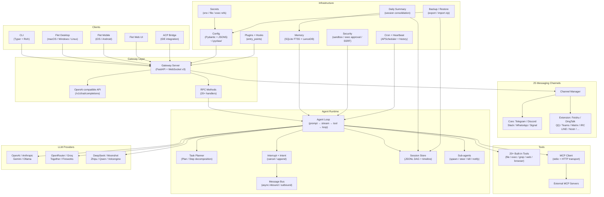

# pyclaw

Multi-channel AI gateway with extensible messaging integrations — Python/Flet rewrite of [openclaw/openclaw](https://github.com/openclaw/openclaw).

pyclaw connects your AI assistant to **25 messaging channels** (Telegram, Discord, Slack, WhatsApp, DingTalk, QQ, and more) through a unified gateway, with **MCP tool integration**, **20+ built-in tools**, a **cross-platform desktop/mobile/web UI**, and an **OpenAI-compatible HTTP API**.

> **[完整文档](docs/README.md)** — 快速开始、安装指南、配置详解、概念总览、故障排除等。

---

## Features

### Agent Runtime
- Multi-provider LLM streaming (OpenAI, Anthropic, Google Gemini, Ollama, and 20+ more)
- 20+ built-in tools: file I/O, grep, find, exec, web search/fetch, browser, memory, cron, TTS, etc.
- MCP (Model Context Protocol) support — connect any stdio or HTTP MCP server
- **Task planner** — multi-step Plan/Step decomposition with automatic step detection, pause/resume
- **User interrupt system** — cancel or append context mid-generation (dual-mode: cancel/append)
- **Intent analyzer** — bilingual (CN/EN) rule-based intent classification (stop/correction/append/continue)
- **Message bus** — async session-level message routing with non-blocking peek for interrupt detection
- **Runtime context injection** — channel/session context flows through to tool execution
- Sub-agent orchestration (spawn, steer, kill) with parent notification and task tracking
- SKILL.md-based skill injection with ClawHub marketplace
- JSONL DAG session storage with compaction and message-level timeline
- Thinking mode (disabled / low / high)
- 7-tier priority agent routing via bindings

### Messaging Channels
- 25 channels: Telegram, Discord, Slack, WhatsApp, Signal, iMessage, Feishu, DingTalk, QQ, MS Teams, Matrix, IRC, LINE, Twitch, Nostr, and more
- Unified `ChannelPlugin` interface — each channel is a self-contained module
- DM and group policy, allowFrom whitelists, mention gating
- Draft streaming, ack reactions, typing indicators

### Gateway
- FastAPI + WebSocket v3 bidirectional protocol
- OpenAI-compatible HTTP API (`/v1/chat/completions`, `/v1/responses`, `/v1/models`)
- 25+ RPC methods: chat, sessions, agents, channels, config, models, browser, cron, plan, backup, tools, etc.
- Config hot-reload, channel health monitoring, control-plane rate limiting
- Token and password authentication

### Desktop / Mobile / Web UI
- **Flet UI** — cross-platform Python UI (macOS, Linux, Windows, iOS, Android, Web)
  - **17-page navigation**:
    - **Chat** — 流式消息、工具可视化、搜索、导出
    - **Overview** — Gateway 连接管理
    - **Agents** — 多 Tab 子面板（Overview/Files/Tools/Skills/Channels/Cron）
    - **Channels** — 渠道状态与能力徽章
    - **Instances** — 在线设备 Presence
    - **Sessions** — 会话运维（过滤/编辑/删除）
    - **Usage** — 用量统计与分析
    - **Cron** — 定时任务管理
    - **Plans** — 执行计划跟踪
    - **Skills** — 技能管理（启停/Key/安装）
    - **Nodes** — 设备配对与节点绑定
    - **Voice** — TTS/STT 语音交互
    - **Logs** — 实时日志查看
    - **Debug** — 手工 RPC 与事件日志
    - **Config** — 配置编辑（Raw + Form）
    - **System** — 系统信息与备份
    - **Settings** — 模型/主题/语言配置
  - Gateway WebSocket integration with local fallback
  - Voice interaction (edge-tts + Whisper), system tray, multi-language (EN/中文/日本語)
- **Flutter App** — archived reference design (`flutter_app/`, see `ARCHIVE_NOTICE.md`)
  - 9 feature pages with Riverpod state management, go_router navigation
  - UI/UX patterns (Shimmer, Material 3 theme, animations) backported to Flet UI
  - Responsive shell: Desktop (NavigationRail) / Tablet (drawer) / Mobile (bottom bar)
  - Dynamic theme color picker, dark/light/system mode, Google Fonts
  - Gateway WebSocket v3 client (Dart), auto-reconnect, heartbeat

### Security
- Command exec approval rules
- Workspace sandbox boundary
- Gateway hardening (replay guard, auth canonicalization)
- SSRF prevention (private IP/DNS blocking)
- Plaintext secret scanning and automatic replacement
- Configuration security audit (`pyclaw security audit`)

### Infrastructure
- Scheduled tasks (APScheduler) — cron / interval / one-time schedules, execution history, channel notification
- **Daily summary service** — automated session consolidation and summarization to memory store
- **Data backup/restore** — CLI and Gateway RPC for exporting and importing config, sessions, and memory
- Heartbeat periodic wake-up
- System service management (launchd / systemd / schtasks)
- LAN discovery (mDNS/Bonjour) + Tailscale VPN integration
- Device pairing (challenge/response)
- Plugin and hook system (entry-point discovery)
- Docker and Docker Compose deployment

---

## Quick Start

### Requirements

- Python >= 3.12
- An LLM API key (OpenAI, Anthropic, Google Gemini, Ollama, or any OpenAI-compatible provider)

### Install

```bash
# One-line install (macOS / Linux)
curl -fsSL https://raw.githubusercontent.com/chensaics/openclaw-py/master/scripts/install.sh | bash

# One-line install with local model support
curl -fsSL https://raw.githubusercontent.com/chensaics/openclaw-py/master/scripts/install.sh | bash -s -- --extras llamacpp
curl -fsSL https://raw.githubusercontent.com/chensaics/openclaw-py/master/scripts/install.sh | bash -s -- --extras mlx   # Apple Silicon only

# Windows (PowerShell)
irm https://raw.githubusercontent.com/chensaics/openclaw-py/master/scripts/install.ps1 | iex

# From PyPI
pip install openclaw-py

# Or via pipx (isolated environment, recommended for CLI usage)
pipx install openclaw-py

# Uninstall (macOS / Linux)
curl -fsSL https://raw.githubusercontent.com/chensaics/openclaw-py/master/scripts/uninstall.sh | bash
# Uninstall + remove data: add --purge
curl -fsSL https://raw.githubusercontent.com/chensaics/openclaw-py/master/scripts/uninstall.sh | bash -s -- --purge

# Uninstall (Windows PowerShell)
irm https://raw.githubusercontent.com/chensaics/openclaw-py/master/scripts/uninstall.ps1 | iex

# macOS via Homebrew
brew install chensaics/tap/pyclaw

# From source (development)
pip install -e .

# With all optional extras
pip install -e ".[all]"

# Docker
docker run -it --rm -e OPENAI_API_KEY="sk-..." ghcr.io/chensaics/openclaw-py:latest pyclaw agent "Hello"
```

Optional extras:

| Extra | What it adds |
|-------|-------------|
| `ui` | Flet desktop UI + system tray |
| `matrix` | Matrix channel (matrix-nio) |
| `whatsapp` | WhatsApp channel (neonize) |
| `voice` | Voice TTS (edge-tts) |
| `dev` | Testing + linting (pytest, ruff, mypy) |
| `all` | ui + matrix + voice |

### First Run

```bash
# 1. Interactive setup — configure provider, model, API key
pyclaw setup --wizard

# 2. Chat with the agent
pyclaw agent "What is the weather in Tokyo?"

# 3. Start the gateway (serves channels + API)
pyclaw gateway

# 4. Launch the desktop UI
pyclaw ui

# 5. Or launch as a web app
pyclaw ui --web --port 8550
```

---

## CLI Reference

### Core

| Command | Description |
|---------|-------------|
| `pyclaw setup --wizard` | Interactive setup wizard |
| `pyclaw setup --non-interactive` | Headless setup (env vars) |
| `pyclaw agent <message>` | Run a single agent turn |
| `pyclaw gateway` | Start the gateway server |
| `pyclaw ui` | Launch desktop UI |
| `pyclaw ui --web` | Launch web UI |
| `pyclaw status [--deep]` | Show status / probe health |
| `pyclaw doctor` | Run diagnostics |

### Configuration

| Command | Description |
|---------|-------------|
| `pyclaw config list` | Show all config |
| `pyclaw config get <key>` | Get a config value |
| `pyclaw config set <key> <value>` | Set a config value |

### Agents & Routing

| Command | Description |
|---------|-------------|
| `pyclaw agents list` | List agents |
| `pyclaw agents add <name> --model <model>` | Add an agent |
| `pyclaw agents bindings list` | Show routing rules |

### Channels

| Command | Description |
|---------|-------------|
| `pyclaw channels list` | List channels |
| `pyclaw channels status` | Connection status |
| `pyclaw message send --channel <ch> --chat-id <id> "text"` | Send a message |

### Auth

| Command | Description |
|---------|-------------|
| `pyclaw auth login --provider <name>` | Add API key profile |
| `pyclaw auth login --provider github-copilot` | Device-code OAuth login |
| `pyclaw auth status` | Show auth profiles |

### MCP

| Command | Description |
|---------|-------------|
| `pyclaw mcp status` | Show MCP servers and tools |
| `pyclaw mcp list-tools` | List available MCP tools |

### Skills & Workspace

| Command | Description |
|---------|-------------|
| `pyclaw skills search <query>` | Search ClawHub marketplace |
| `pyclaw skills install <name>` | Install a skill |
| `pyclaw skills list` | List installed skills |
| `pyclaw skills remove <name>` | Uninstall a skill |
| `pyclaw workspace sync` | Sync workspace templates |
| `pyclaw workspace diff` | Compare workspace vs templates |

### Data Backup

| Command | Description |
|---------|-------------|
| `pyclaw backup export --output <path>` | Export config, sessions, summaries, memory to zip |
| `pyclaw backup import <archive> [--force]` | Import and restore from a backup archive |

### Operations

| Command | Description |
|---------|-------------|
| `pyclaw service install` | Install as system service |
| `pyclaw service status` | Check service status |
| `pyclaw secrets audit` | Scan for plaintext secrets |
| `pyclaw secrets apply` | Replace secrets with refs |
| `pyclaw security audit [--deep] [--fix]` | Security audit |
| `pyclaw logs [--follow]` | Tail runtime logs |
| `pyclaw sessions list` | List sessions |
| `pyclaw sessions cleanup` | Clean up stale sessions |

### Browser Automation

| Command | Description |
|---------|-------------|
| `pyclaw browser start` | Start browser session |
| `pyclaw browser navigate --url <url>` | Navigate to URL |
| `pyclaw browser screenshot` | Take screenshot |
| `pyclaw browser click --selector <sel>` | Click element |

---

## Supported Channels

| Channel | Library / Protocol | Type |
|---------|-------------------|------|
| Telegram | aiogram | Core |
| Discord | discord.py | Core |
| Slack | slack-bolt (Socket Mode) | Core |
| WhatsApp | neonize (Baileys) | Core |
| Signal | signal-cli JSON-RPC | Core |
| iMessage | imsg JSON-RPC | Core |
| Web | Built-in | Core |
| Feishu / Lark | Open Platform API (WebSocket) | Extension |
| DingTalk | Stream Mode (WebSocket) | Extension |
| QQ | QQ Bot (WebSocket) | Extension |
| MS Teams | Bot Framework + Graph API | Extension |
| Matrix | matrix-nio | Extension |
| IRC | Native TCP/TLS | Extension |
| LINE | Messaging API | Extension |
| Twitch | IRC/TLS | Extension |
| BlueBubbles | REST webhook | Extension |
| Google Chat | OAuth webhook | Extension |
| Mattermost | REST + WebSocket | Extension |
| Nextcloud Talk | REST webhook | Extension |
| Synology Chat | Incoming webhook | Extension |
| Tlon / Urbit | HTTP API | Extension |
| Zalo | Official API | Extension |
| Nostr | NIP-04 relay | Extension |
| Voice Call | Twilio | Extension |

## Supported LLM Providers

### Core Providers (built-in streaming)

| Provider | Models |
|----------|--------|
| OpenAI | GPT-4o, GPT-4o-mini, o1, o3-mini |
| Anthropic | Claude Sonnet, Claude Haiku |
| Google Gemini | Gemini 2.0 Flash, Gemini Pro |
| Ollama | Any locally hosted model |

### OpenAI-Compatible Providers

| Provider | Region | Notes |
|----------|--------|-------|
| OpenRouter | Global | Access to all models |
| Together AI | Global | Open-source models |
| Groq | Global | Fast inference + Whisper |
| Fireworks AI | Global | Fast inference |
| Perplexity | Global | Search-augmented |

### Chinese Providers (中国提供商)

| Provider | Notes |
|----------|-------|
| DeepSeek | DeepSeek-V2 / DeepSeek-Coder |
| Moonshot / Kimi | 128k context |
| Zhipu / GLM | GLM-4 series |
| Qwen / DashScope | Qwen series |
| Volcengine / 火山引擎 | Doubao models |
| MiniMax | MiniMax models |
| Qianfan / 百度 | ERNIE series |
| Xiaomi | MiLM |

### Additional Providers

| Provider | Notes |
|----------|-------|
| Amazon Bedrock | Claude, Titan, etc. |
| vLLM | Self-hosted, OpenAI-compatible |
| NVIDIA NIM | NVIDIA inference |
| HuggingFace | Inference API |
| LiteLLM | Universal proxy |
| GitHub Copilot | OAuth device-code login |
| OpenAI Codex | OAuth login |

---

## MCP (Model Context Protocol)

Connect external tool servers via [MCP](https://modelcontextprotocol.io). The config format is compatible with Claude Desktop and Cursor — you can copy MCP server configs directly.

Add to `~/.pyclaw/pyclaw.json`:

```json
{
  "tools": {
    "mcpServers": {
      "filesystem": {
        "command": "npx",
        "args": ["-y", "@modelcontextprotocol/server-filesystem", "/path/to/dir"]
      },
      "remote-api": {
        "url": "https://example.com/mcp/",
        "headers": { "Authorization": "Bearer xxx" },
        "toolTimeout": 60
      }
    }
  }
}
```

| Mode | Config | Use case |
|------|--------|----------|
| **Stdio** | `command` + `args` | Local process (npx, uvx, python) |
| **HTTP** | `url` + `headers` | Remote MCP endpoint |

MCP tools are auto-discovered on startup and available to the agent alongside built-in tools. Use `pyclaw mcp status` to inspect.

---

## Configuration

pyclaw stores its state in `~/.pyclaw/`:

```
~/.pyclaw/
├── pyclaw.json          # Main config (JSON5 with comments)
├── auth-profiles.json   # API keys and OAuth credentials
├── credentials/         # Web provider credential files
├── sessions/            # Agent session transcripts (JSONL)
└── workspace/           # Workspace files (AGENTS.md, HEARTBEAT.md, etc.)
```

### Setup

```bash
# Interactive wizard
pyclaw setup --wizard

# Or configure directly
pyclaw config set models.default "claude-sonnet-4-20250514"
pyclaw config set channels.telegram.token "your-bot-token"
pyclaw config set channels.telegram.enabled true
```

### Example Config

```json
{
  "models": {
    "providers": {
      "openai": { "apiKey": "sk-..." },
      "anthropic": { "apiKey": "sk-ant-..." }
    }
  },
  "agents": {
    "defaults": {
      "model": "gpt-4o",
      "provider": "openai"
    }
  },
  "channels": {
    "telegram": {
      "enabled": true,
      "token": "123456:ABC-DEF",
      "allowFrom": ["your_user_id"]
    },
    "dingtalk": {
      "enabled": true,
      "clientId": "your_app_key",
      "clientSecret": "your_app_secret"
    }
  },
  "tools": {
    "mcpServers": {
      "fs": {
        "command": "npx",
        "args": ["-y", "@modelcontextprotocol/server-filesystem", "/tmp"]
      }
    }
  }
}
```

### Environment Variables

Core variables (see `.env.example` for full list):

| Variable | Description |
|----------|-------------|
| `OPENAI_API_KEY` | OpenAI API key |
| `ANTHROPIC_API_KEY` | Anthropic API key |
| `GOOGLE_API_KEY` | Google AI API key |
| `TELEGRAM_BOT_TOKEN` | Telegram bot token |
| `PYCLAW_AUTH_TOKEN` | Gateway auth token |
| `PYCLAW_GATEWAY_PORT` | Gateway port (default: 18789) |
| `PYCLAW_STATE_DIR` | State directory (default: `~/.pyclaw`) |

---

## Gateway API

The gateway exposes two API surfaces:

### WebSocket (port 18789)

Full bidirectional protocol for real-time agent interaction, session management, and event streaming. Supports 25+ RPC methods:

- `connect`, `health`, `status`
- `chat.send`, `chat.abort`
- `sessions.list`, `sessions.get`, `sessions.create`, `sessions.cleanup`
- `config.get`, `config.set`, `config.patch`
- `agents.list`, `agents.bindings`
- `channels.list`, `channels.status`
- `models.list`, `models.probe`
- `browser.*`, `cron.*`, `cron.history`, `tools.*`
- `plan.list`, `plan.get`, `plan.resume`, `plan.delete`
- `backup.export`, `backup.status`
- And more

### HTTP (OpenAI-compatible)

| Endpoint | Description |
|----------|-------------|
| `POST /v1/chat/completions` | Chat completions (streaming SSE) |
| `POST /v1/responses` | Responses API (streaming SSE) |
| `GET /v1/models` | List available models |

---

## Docker

### Docker Compose (recommended)

```bash
# First-time setup
docker compose run --rm pyclaw-cli setup --non-interactive --accept-risk

# Edit config
vim ~/.pyclaw/pyclaw.json

# Start gateway
docker compose up -d pyclaw-gateway

# Run a CLI command
docker compose run --rm pyclaw-cli agent "Hello!"

# View logs
docker compose logs -f pyclaw-gateway

# Stop
docker compose down
```

### Docker

```bash
# Build
docker build -t pyclaw .

# Initialize config
docker run -v ~/.pyclaw:/root/.pyclaw --rm pyclaw setup --non-interactive --accept-risk

# Run gateway
docker run -v ~/.pyclaw:/root/.pyclaw -p 18789:18789 -p 18790:18790 pyclaw gateway

# Run CLI
docker run -v ~/.pyclaw:/root/.pyclaw --rm pyclaw agent "Hello!"
```

### System Service

```bash
# Install as system service (auto-detects launchd/systemd/schtasks)
pyclaw service install

# Check status
pyclaw service status

# Restart after config changes
pyclaw service restart
```

---

## Architecture

```
openclaw-py/
├── src/pyclaw/
│   ├── main.py                  # CLI entry point
│   │
│   ├── agents/                  # Agent runtime
│   │   ├── runner.py            # Core loop: prompt → LLM stream → tool exec → loop
│   │   ├── stream.py            # Multi-provider streaming (OpenAI/Anthropic/Gemini/Ollama)
│   │   ├── session.py           # JSONL DAG session storage + compaction + timeline
│   │   ├── planner.py           # Task Plan/Step decomposition + step detection
│   │   ├── interrupt.py         # User interrupt (cancel/append) context
│   │   ├── intent.py            # Bilingual intent classification (rule-based)
│   │   ├── auth_profiles/       # Multi-mode auth (API key, token, OAuth)
│   │   ├── providers/           # 25+ LLM provider adapters
│   │   ├── subagents/           # Sub-agent management (spawn/steer/kill/notify)
│   │   ├── skills/              # SKILL.md discovery + ClawHub marketplace
│   │   ├── workspace_sync.py    # Workspace template sync
│   │   ├── model_catalog.py     # Model registry (aliases, costs, capabilities)
│   │   ├── tool_policy.py       # Tool access control (group/plugin allowlist)
│   │   └── tools/               # 20+ built-in tools + MCP bridge + runtime context
│   │
│   ├── mcp/                     # MCP (Model Context Protocol) client
│   │   ├── client.py            # Server connection + tool discovery
│   │   ├── registry.py          # Multi-server management + McpToolAdapter
│   │   ├── stdio_transport.py   # Local process stdio transport
│   │   └── http_transport.py    # Remote HTTP transport
│   │
│   ├── gateway/                 # Gateway server
│   │   ├── server.py            # FastAPI + WebSocket v3 protocol
│   │   ├── openai_compat.py     # /v1/chat/completions + /v1/models
│   │   ├── openresponses_http.py # /v1/responses (streaming SSE)
│   │   ├── message_bus.py       # Async dual-channel message bus
│   │   └── methods/             # 25+ RPC method handlers (incl. plan, cron history, backup)
│   │
│   ├── channels/                # 25 messaging channels
│   │   ├── base.py              # ChannelPlugin abstract interface
│   │   ├── manager.py           # Channel lifecycle management
│   │   ├── telegram/            # aiogram
│   │   ├── discord/             # discord.py
│   │   ├── slack/               # slack-bolt (Socket Mode)
│   │   ├── dingtalk/            # DingTalk Stream Mode (WebSocket)
│   │   ├── qq/                  # QQ Bot (WebSocket)
│   │   └── ...                  # + 18 more channels
│   │
│   ├── cli/                     # Typer CLI (25+ command groups)
│   │   ├── app.py               # Command registration
│   │   └── commands/            # setup, doctor, agent, gateway, config, agents,
│   │                            # channels, auth, models, devices, message, service,
│   │                            # mcp, skills, workspace, sessions, browser, security,
│   │                            # backup, ...
│   │
│   ├── config/                  # Configuration (Pydantic + JSON5)
│   │   ├── schema.py            # PyClawConfig root model (30+ sections)
│   │   ├── io.py                # Load / save / merge
│   │   ├── env_substitution.py  # ${VAR} / ${VAR:-default} expansion
│   │   ├── includes.py          # $include config splitting
│   │   └── backup.py            # Atomic writes with backup rotation
│   │
│   ├── memory/                  # Memory / RAG
│   │   ├── store.py             # SQLite + FTS5 full-text search
│   │   ├── daily_summary.py     # Automated daily session summarization
│   │   ├── lancedb_backend.py   # LanceDB vector search
│   │   ├── hybrid.py            # Vector + keyword merge
│   │   ├── mmr.py               # MMR diversity re-ranking
│   │   ├── temporal_decay.py    # Time-weighted scoring
│   │   └── embeddings.py        # Embedding providers (OpenAI/Gemini/Voyage/Mistral)
│   │
│   ├── acp/                     # Agent Control Protocol (IDE integration)
│   ├── security/                # Exec approval, sandbox, SSRF guard, audit
│   ├── secrets/                 # Plaintext secret scan + env/file/exec refs
│   ├── hooks/                   # Event hook system (HOOK.md discovery)
│   ├── plugins/                 # Plugin system (entry-point + extensions)
│   ├── routing/                 # 7-tier priority message routing
│   ├── media/                   # Media understanding (multi-provider)
│   ├── cron/                    # APScheduler job runner + execution history
│   ├── infra/                   # Retry, rate-limit, heartbeat, mDNS, Tailscale
│   ├── daemon/                  # System service (launchd/systemd/schtasks)
│   ├── canvas/                  # Canvas host (HTTP + WebSocket live-reload)
│   ├── node_host/               # Headless node service
│   ├── browser/                 # Playwright browser automation
│   ├── logging/                 # Structured logging + redaction
│   ├── markdown/                # Markdown IR + multi-channel rendering
│   ├── pairing/                 # Device pairing (challenge/response)
│   ├── terminal/                # ANSI tables, palette
│   └── ui/                      # Flet UI
│       ├── app.py               # Chat + Settings + Sessions + 17-page nav
│       ├── gateway_client.py    # WebSocket v3 Gateway client (Python)
│       ├── i18n.py              # Multi-language (en/zh-CN/ja)
│       ├── voice.py             # Voice interaction (TTS + Whisper)
│       ├── onboarding.py        # 4-step setup wizard
│       └── tray.py              # System tray icon
│
├── flutter_app/                 # [Archived] Flutter reference design (Material 3)
│   ├── lib/
│   │   ├── main.dart            # Entry point
│   │   ├── app.dart             # MaterialApp + go_router
│   │   ├── core/
│   │   │   ├── gateway_client.dart    # WebSocket v3 client (Dart)
│   │   │   ├── models/          # Message, Session, Plan, CronJob, Agent, Channel
│   │   │   ├── providers/       # Riverpod state (Gateway, Chat, Session, Config, Plan)
│   │   │   └── theme/           # Material 3 theme, colors, typography
│   │   ├── features/            # 9 pages: Chat, Sessions, Agents, Channels,
│   │   │                        #   Plans, Cron, System, Backup, Settings
│   │   └── widgets/             # MessageBubble, ToolCallCard, PlanProgress,
│   │                            #   CodeBlock, ModelSelector, ResponsiveShell
│   ├── test/                    # 49 unit tests
│   └── pubspec.yaml             # Flutter 3.x + Riverpod 2.x + go_router
│
├── tests/                       # 78 test files, 1848+ tests
├── flet_app.py                  # Flet entry point (mobile/desktop build)
├── scripts/                     # build-desktop.sh, build-mobile.sh
├── Dockerfile                   # Multi-stage container build
├── docker-compose.yml           # Gateway + CLI services
├── pyproject.toml               # Hatch build + dependencies
└── docs/reference/              # Progress tracking + plans
```

### Technical Stack

| Layer | Technology |
|-------|-----------|
| Language | Python 3.12+ |
| Web framework | FastAPI + Uvicorn |
| WebSocket | websockets |
| HTTP client | httpx |
| CLI | Typer + Rich |
| Data validation | Pydantic v2 |
| Config format | JSON5 |
| Database | SQLite + FTS5 (aiosqlite) |
| Vector search | LanceDB |
| LLM SDKs | openai, anthropic, google-generativeai |
| Messaging | aiogram, discord.py, slack-bolt |
| Browser | Playwright |
| UI (Python) | Flet |
| UI (Native) | Flutter 3.x + Riverpod 2.x + Material 3 |
| TTS | edge-tts |
| Scheduling | APScheduler |
| Testing | pytest, pytest-asyncio, pytest-cov |
| Linting | ruff |
| Type checking | mypy (strict) |
| Build | Hatch |

---

## Development

```bash
# Install with dev dependencies
pip install -e ".[dev,ui]"

# Run all tests
pytest

# Run tests with coverage
pytest --cov=pyclaw --cov-report=term-missing

# 增量测试（相对 origin/master，仅相关包/改动测试文件）— 见 docs/testing-incremental.md
hatch run test-inc -- -q

# Lint
ruff check src/ tests/

# Format
ruff format src/ tests/

# Type check
mypy src/pyclaw/
```

## System Architecture



### Project Stats

| Metric | Value |
|--------|-------|
| Source files | ~440 .py + 46 .dart |
| Source code | ~66,400 LOC (Python) + ~4,980 LOC (Dart) |
| Test files | 92 (.py) + 4 (.dart) |
| Tests | 1,932+ (Python) + 49 (Dart) |
| Channels | 25 |
| LLM providers | 25+ |
| Built-in tools | 20+ |
| RPC methods | 25+ |
| CLI commands | 25+ groups |

---

## Contributing

Pull requests welcome. The project follows standard Python conventions:

- Code style enforced by `ruff` (E/F/I/UP/B/SIM rules)
- Type annotations enforced by `mypy --strict`
- All new features should include tests
- Async-first architecture throughout

---

## Acknowledgements

This project is inspired by [OpenClaw](https://github.com/openclaw/openclaw) (originally built with a TypeScript stack). pyclaw is a ground-up rewrite using **Python + Flet + Flutter**, with additional features, aiming to provide a more accessible, extensible, and easily deployable multi-channel AI gateway.

The project serves both as a learning reference for AI Agent development, MCP protocol integration, and multi-channel messaging — and as a production-ready system.

Thanks to the following projects and communities:

- [OpenClaw](https://github.com/openclaw/openclaw) — the original project that provided core architectural inspiration
- [Flet](https://flet.dev) — cross-platform Python UI framework built on Flutter

---

## License

[MIT](LICENSE) — Copyright (c) 2026 CHEN SAI
