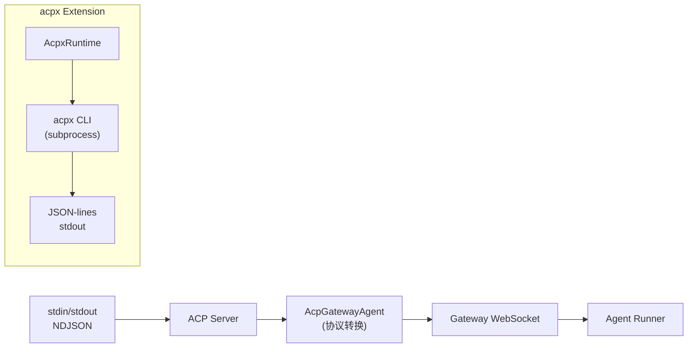
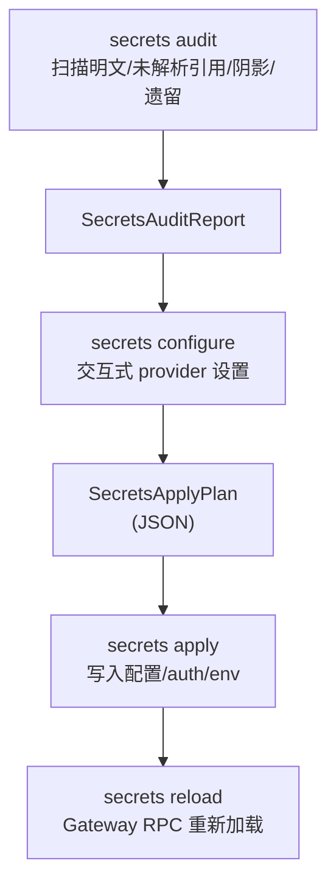
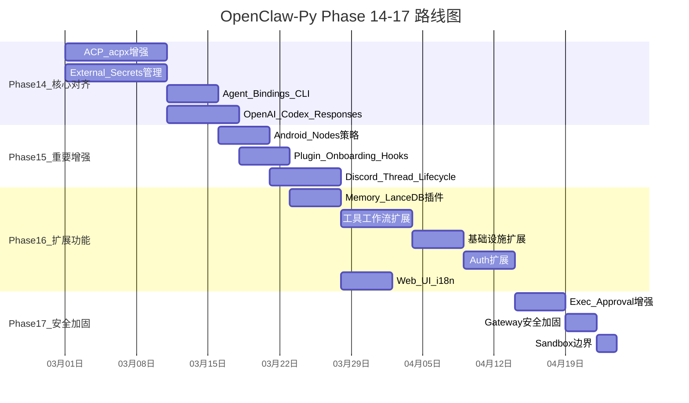

# OpenClaw-Py 后续实施计划 (Phase 14+)

> 生成日期: 2026-02-28
>
> Phase 0-13 全部完成 (248 个 .py 文件, ~22,800 LOC, 261 tests)。
> TypeScript 主项目在 2026.2.25-2026.2.27 期间新增了多项重要功能，
> Python 版本需要跟进。本文档覆盖 11 项功能差距，分为 Phase 14-17。

---

## 当前状态

- **~265 个 .py 文件 / ~25,500 LOC** — Phase 0-14 全部完成
- **353 个测试通过** — 覆盖 ~30 个模块
- **23 个消息通道** — 6 核心 + 17 扩展
- **CI/CD** — GitHub Actions (test + lint + release)
- **原生 App 打包** — Flet build 入口 (macOS/Linux/Windows/iOS/Android)

### Phase 14 执行状态 (已完成)

- **14a**: ACP/acpx — control_plane.py, acpx_runtime.py, session_mapper.py, event_mapper.py, thread_ownership.py
- **14b**: Secrets — secrets/ 模块 (audit, resolve, plan, apply, runtime) + CLI + Gateway method
- **14c**: Bindings — routing/bindings.py (7 级优先级) + CLI (bindings/bind/unbind)
- **14d**: Codex — openresponses_http.py + agents/transports/codex.py (context_management)
- **测试**: 4 个测试文件, 92 个新测试全部通过

---

## 差距概览

以下功能在 TypeScript 2026.2.25-2026.2.27 中新增或重大升级，Python 版本尚未覆盖：

| # | 功能 | TS 规模 | 优先级 | Phase |
|---|------|---------|--------|-------|
| 1 | ACP / acpx thread-bound agents | ~5,100 LOC / 61 文件 | P0 | 14 |
| 2 | External Secrets 管理 | ~2,800 LOC / 16 文件 | P0 | 14 |
| 3 | Agent Bindings CLI | ~900 LOC / 5 文件 | P0 | 14 |
| 4 | OpenAI Codex + Responses API | ~1,400 LOC / 10 文件 | P0 | 14 |
| 5 | Android Nodes | ~3,300 LOC (Kotlin+TS) | P1 | 15 |
| 6 | Plugin Onboarding Hooks | ~1,400 LOC / 5 文件 | P1 | 15 |
| 7 | Discord Thread Lifecycle | ~1,570 LOC / 7 文件 | P1 | 15 |
| 8 | Memory Plugins (LanceDB) | ~600 LOC / 5 文件 | P2 | 16 |
| 9 | Non-channel Extensions | ~2,000 LOC / 30+ 文件 | P2 | 16 |
| 10 | Web UI i18n | ~200 LOC | P2 | 16 |
| 11 | Security Hardening | ~1,100 LOC / 8 文件 | P3 | 17 |

---

## Phase 14: 核心功能对齐 (P0)

### 14a. ACP / acpx Thread-bound Agents

Python 版已有基础 ACP 模块 (`src/openclaw/acp/`)，但缺少 acpx 运行时后端和线程所有权扩展。

**TS 参考:**
- `src/acp/` (43 文件, ~3,800 LOC) — session store, translator, control-plane, runtime registry
- `extensions/acpx/` (15 文件, ~1,200 LOC) — 通过 `acpx` CLI 的 ACP 运行时后端
- `extensions/thread-ownership/` (3 文件, ~130 LOC) — Slack 线程所有权管理

**Python 实施方案:**

| 模块 | 新增文件 | 预估 LOC | 说明 |
|------|---------|---------|------|
| ACP 增强 | 6 | ~800 | translator, control-plane (manager/spawn/registry), session-mapper, event-mapper |
| acpx 运行时 | 4 | ~500 | runtime.py (AcpxRuntime), config.py, ensure.py, process.py |
| thread-ownership | 2 | ~100 | plugin hook (message_received/message_sending), thread TTL 追踪 |
| 测试 | 2 | ~300 | test_acp_enhanced.py, test_acpx.py |

**关键接口:**

```python
class AcpGatewayAgent:
    """ACP 协议 <-> Gateway 事件转换器"""
    async def handle_initialize(self, params: InitializeParams) -> InitializeResult: ...
    async def handle_new_session(self, params: NewSessionParams) -> SessionInfo: ...
    async def handle_prompt(self, params: PromptParams) -> AsyncIterator[PromptEvent]: ...
    async def handle_cancel(self, params: CancelParams) -> None: ...

class AcpxRuntime:
    """通过 acpx CLI 子进程的 ACP 运行时"""
    async def ensure_session(self, agent: str, cwd: str) -> AcpxHandleState: ...
    async def run_turn(self, handle: AcpxHandleState, prompt: str) -> AsyncIterator[AcpxEvent]: ...
    async def get_status(self, handle: AcpxHandleState) -> AcpxStatus: ...
    async def cancel(self, handle: AcpxHandleState) -> None: ...
```

**数据流:**



### 14b. External Secrets 管理

当前 Python 版配置中 `SecretRef` 类型已定义，但缺少完整的 secrets 工作流。

**TS 参考:**
- `src/secrets/` (~15 文件, ~2,500 LOC) — resolve, plan, config-io, ref-contract, provider-env-vars, runtime
- `src/cli/secrets-cli.ts` (~245 LOC) — CLI 入口

**Python 实施方案:**

| 模块 | 新增文件 | 预估 LOC | 说明 |
|------|---------|---------|------|
| secrets 核心 | 6 | ~1,200 | audit.py, configure.py, apply.py, resolve.py, plan.py, runtime.py |
| CLI 命令 | 1 | ~150 | cli/commands/secrets.py (audit/configure/apply/reload) |
| Gateway 方法 | 1 | ~80 | methods/secrets.py (secrets.reload RPC) |
| 测试 | 1 | ~200 | test_secrets.py |

**工作流:**



**核心类型:**

```python
class SecretProviderConfig(BaseModel):
    kind: Literal["env", "file", "exec"]
    env_prefix: str | None = None
    file_path: str | None = None
    exec_command: str | None = None

class SecretsPlanTarget(BaseModel):
    path: str                     # e.g. "models.providers.openai.apiKey"
    ref: SecretRef
    current_value: str | None = None

class SecretsApplyPlan(BaseModel):
    targets: list[SecretsPlanTarget]
    providers: dict[str, SecretProviderConfig]
    scrub_env: bool = False
    scrub_legacy: bool = False
```

### 14c. Agent Bindings CLI

当前 Python 版有基础路由 (`src/openclaw/routing/`)，但缺少 account-scoped binding 管理。

**TS 参考:**
- `src/commands/agents.bindings.ts` + `agents.commands.bind.ts` (~900 LOC)
- `src/routing/resolve-route.ts` — 7 级优先级匹配
- `src/config/types.agents.ts` — `AgentBinding` 类型

**Python 实施方案:**

| 模块 | 新增文件 | 预估 LOC | 说明 |
|------|---------|---------|------|
| Bindings 逻辑 | 1 | ~300 | routing/bindings.py (build, parse, resolve, account-scoped) |
| CLI 命令 | 1 | ~150 | cli/commands/bindings.py (bindings/bind/unbind) |
| 路由增强 | 0 (修改) | ~100 | routing/dispatch.py 添加 7 级优先级匹配 |
| 测试 | 1 | ~150 | test_bindings.py |

**Binding 匹配优先级 (7 级):**

```
1. peer-specific    (binding.match.peer.kind + peer.id)
2. parent-peer      (binding.match.peer.parent)
3. guild+roles      (binding.match.guildId + roles)
4. guild-only       (binding.match.guildId)
5. team-only        (binding.match.teamId)
6. account-scoped   (binding.match.accountId)
7. channel-only     (binding.match.channel)
```

**AgentBinding 模型:**

```python
class AgentBindingMatch(BaseModel):
    channel: str
    account_id: str | None = None
    peer: PeerMatch | None = None
    guild_id: str | None = None
    team_id: str | None = None
    roles: list[str] | None = None

class AgentBinding(BaseModel):
    agent_id: str
    match: AgentBindingMatch
```

### 14d. OpenAI Codex + Responses API

当前 Python 版有 OpenAI 兼容 API (`/v1/chat/completions`)，但缺少 Codex WebSocket 传输和 Responses API。

**TS 参考:**
- `src/gateway/openresponses-http.ts` (~624 LOC) — `/v1/responses` 端点
- `src/agents/pi-embedded-runner/extra-params.ts` — context_management, Codex 传输包装
- `src/gateway/open-responses.schema.ts` — 请求/响应 schema

**Python 实施方案:**

| 模块 | 新增文件 | 预估 LOC | 说明 |
|------|---------|---------|------|
| Responses API | 2 | ~400 | gateway/openresponses_http.py, gateway/openresponses_schema.py |
| Codex 传输 | 1 | ~150 | agents/transports/codex.py (WebSocket-first + SSE fallback) |
| context_management | 0 (修改) | ~100 | agents/stream.py 添加 compaction 注入 |
| Provider 用量 | 1 | ~80 | infra/provider_usage_codex.py |
| 测试 | 1 | ~200 | test_openresponses.py |

**context_management 逻辑:**

```python
def inject_context_management(
    payload: dict,
    model: ModelConfig,
    provider: str,
) -> dict:
    """为 OpenAI Responses 模型注入 server-side compaction"""
    if provider != "openai" or not model.responses_server_compaction:
        return payload
    if "context_management" not in payload:
        threshold = model.responses_compact_threshold or int(
            (model.context_window or 128_000) * 0.7
        )
        payload["context_management"] = [{
            "type": "compaction",
            "compact_threshold": min(threshold, 80_000),
        }]
    return payload
```

**Phase 14 总计:**

| 指标 | 数值 |
|------|------|
| 新增文件 | ~23 |
| 新增 LOC | ~3,760 |
| 新增测试文件 | 5 |
| 依赖 | 无新依赖 (acpx 通过 subprocess 调用) |

---

## Phase 15: 重要增强 (P1)

### 15a. Android Nodes

Android 节点是 Kotlin 原生实现，Python 重写不需要重写 Android 端代码，但需要：
1. Gateway 侧的 node 命令策略和工具定义
2. Flet 移动端的节点功能桥接（可选）

**TS 参考:**
- `apps/android/` (~2,500 LOC Kotlin) — 设备端实现
- `src/gateway/node-command-policy.ts` — 平台命令白名单
- `src/agents/tools/nodes-tool.ts` — Agent node 工具

**Python 实施方案:**

| 模块 | 新增文件 | 预估 LOC | 说明 |
|------|---------|---------|------|
| Node 命令策略 | 1 | ~200 | gateway/node_command_policy.py (平台命令白名单 + 能力发现) |
| Node 工具增强 | 0 (修改) | ~150 | tools/nodes.py 添加 device/camera/notifications/contacts/calendar/motion/photos |
| Gateway 方法增强 | 0 (修改) | ~100 | methods/nodes.py 添加 invoke 参数校验 |
| 测试 | 1 | ~150 | test_node_commands.py |

**平台命令白名单:**

```python
DEVICE_COMMANDS = ["device.info", "device.status"]
ANDROID_COMMANDS = [
    *DEVICE_COMMANDS, "device.permissions", "device.health",
    "camera.list", "camera.snap", "camera.clip",
    "notifications.list", "notifications.actions",
    "contacts.search", "contacts.add",
    "calendar.events", "calendar.add",
    "photos.latest",
    "motion.activity", "motion.pedometer",
    "system.notify",
]
IOS_COMMANDS = [*DEVICE_COMMANDS, "camera.list", "photos.latest"]
MACOS_COMMANDS = [*DEVICE_COMMANDS]
```

### 15b. Plugin Onboarding Hooks

当前 Python 版插件系统已有基础 hook 机制，但缺少 onboarding 阶段的交互式配置 hook。

**TS 参考:**
- `src/channels/plugins/onboarding-types.ts` (~100 LOC)
- `src/commands/onboard-channels.ts` (~750 LOC)

**Python 实施方案:**

| 模块 | 新增文件 | 预估 LOC | 说明 |
|------|---------|---------|------|
| Onboarding 类型 | 1 | ~80 | plugins/onboarding_types.py |
| Onboarding 逻辑 | 1 | ~300 | plugins/onboarding.py (configureInteractive, configureWhenConfigured) |
| CLI 集成 | 0 (修改) | ~50 | cli/commands/setup.py 集成 onboarding hooks |
| 测试 | 1 | ~150 | test_onboarding_hooks.py |

**Hook 接口:**

```python
class ChannelOnboardingAdapter(Protocol):
    channel: str

    async def get_status(self, ctx: OnboardingStatusContext) -> OnboardingStatus: ...
    async def configure(self, ctx: OnboardingConfigureContext) -> OnboardingResult: ...
    async def configure_interactive(
        self, ctx: OnboardingInteractiveContext
    ) -> OnboardingConfiguredResult | Literal["skip"]: ...
    async def configure_when_configured(
        self, ctx: OnboardingInteractiveContext
    ) -> OnboardingConfiguredResult | Literal["skip"]: ...
```

**执行顺序:**
1. 如果 `configure_interactive` 存在 → 优先调用（处理未配置和已配置两种状态）
2. 否则如果已配置 + `configure_when_configured` 存在 → 调用
3. 否则 → 调用 `configure`

### 15c. Discord Thread Lifecycle

当前 Python 版 Discord 通道支持基本消息收发，但缺少线程绑定生命周期管理。

**TS 参考:**
- `src/discord/monitor/` (4 文件, ~1,570 LOC) — provider, manager, config, state
- `src/channels/thread-bindings-policy.ts` (~200 LOC)

**Python 实施方案:**

| 模块 | 新增文件 | 预估 LOC | 说明 |
|------|---------|---------|------|
| Thread Bindings 策略 | 1 | ~120 | channels/thread_bindings_policy.py (通用 idle/maxAge 策略) |
| Discord 线程管理 | 2 | ~500 | channels/discord/thread_manager.py, channels/discord/thread_state.py |
| 配置扩展 | 0 (修改) | ~50 | config/schema.py 添加 threadBindings 配置 |
| 测试 | 1 | ~200 | test_thread_lifecycle.py |

**TTL 机制:**

```python
@dataclass
class ThreadBindingRecord:
    thread_id: str
    session_key: str
    bound_at: float        # time.time()
    last_activity_at: float

def is_expired(record: ThreadBindingRecord, idle_hours: float, max_age_hours: float) -> str | None:
    """返回过期原因或 None"""
    now = time.time()
    if idle_hours > 0:
        idle_expires = record.last_activity_at + idle_hours * 3600
        if now >= idle_expires:
            return "idle-expired"
    if max_age_hours > 0:
        age_expires = record.bound_at + max_age_hours * 3600
        if now >= age_expires:
            return "max-age-expired"
    return None
```

**清扫循环:** 每 60 秒检查所有 thread binding，过期则自动解绑。

**Phase 15 总计:**

| 指标 | 数值 |
|------|------|
| 新增文件 | ~9 |
| 新增 LOC | ~2,050 |
| 新增测试文件 | 3 |
| 依赖 | 无新依赖 |

---

## Phase 16: 扩展功能 (P2)

### 16a. Memory Plugins (LanceDB)

当前 Python 版 Memory 系统使用 SQLite + FTS5，需要支持可插拔的后端。

**TS 参考:**
- `extensions/memory-lancedb/` (~600 LOC) — LanceDB 后端 + auto-recall/capture
- `extensions/memory-core/` — 核心 memory provider

**Python 实施方案:**

| 模块 | 新增文件 | 预估 LOC | 说明 |
|------|---------|---------|------|
| Memory 后端接口 | 1 | ~80 | memory/backend.py (MemoryBackend Protocol) |
| LanceDB 后端 | 2 | ~300 | extensions/memory_lancedb/backend.py, extensions/memory_lancedb/plugin.py |
| Auto-recall/capture | 1 | ~150 | extensions/memory_lancedb/hooks.py (before_agent_start/after_agent_end) |
| 测试 | 1 | ~100 | test_memory_lancedb.py |

**可选依赖:** `lancedb >= 0.10`

**后端接口:**

```python
class MemoryBackend(Protocol):
    async def store(self, text: str, vector: list[float], metadata: dict) -> str: ...
    async def search(self, vector: list[float], limit: int = 10) -> list[MemoryResult]: ...
    async def delete(self, memory_id: str) -> bool: ...
    async def close(self) -> None: ...
```

### 16b. Non-channel Extensions

TypeScript 版有多个非通道类扩展插件，Python 版需要对应实现。

**按类别分批实施:**

**批次 1 — 工具/工作流扩展 (~4 个)**

| 扩展 | 新增文件 | 预估 LOC | 说明 |
|------|---------|---------|------|
| lobster | 2 | ~200 | 类型化工作流工具 + 可恢复审批 |
| llm-task | 2 | ~150 | 通用 JSON-only LLM 工具 |
| open-prose | 2 | ~150 | OpenProse VM 技能包 + /prose 斜杠命令 |
| phone-control | 2 | ~120 | 高风险手机节点命令的 arm/disarm 控制 |

**批次 2 — 基础设施扩展 (~3 个)**

| 扩展 | 新增文件 | 预估 LOC | 说明 |
|------|---------|---------|------|
| diagnostics-otel | 2 | ~200 | OpenTelemetry 诊断集成 |
| copilot-proxy | 2 | ~150 | Copilot 代理 provider |
| talk-voice | 2 | ~100 | Talk 语音选择管理 (list/set) |

**批次 3 — Auth 扩展 (~3 个)**

| 扩展 | 新增文件 | 预估 LOC | 说明 |
|------|---------|---------|------|
| google-gemini-cli-auth | 2 | ~150 | Google Gemini CLI OAuth |
| minimax-portal-auth | 2 | ~120 | MiniMax 门户认证 |
| qwen-portal-auth | 2 | ~120 | Qwen 门户认证 |

**可选依赖:** `opentelemetry-api`, `opentelemetry-sdk` (diagnostics-otel 专用)

### 16c. Web UI i18n

当前 Python 版 Flet UI 无多语言支持。

**Python 实施方案:**

| 模块 | 新增文件 | 预估 LOC | 说明 |
|------|---------|---------|------|
| i18n 框架 | 1 | ~80 | ui/i18n.py (locale 加载 + 字符串查找) |
| 语言包 | 3 | ~300 | ui/locales/en.json, ui/locales/de.json, ui/locales/zh.json |
| UI 集成 | 0 (修改) | ~100 | ui/app.py 中所有硬编码字符串替换为 i18n 调用 |

**Phase 16 总计:**

| 指标 | 数值 |
|------|------|
| 新增文件 | ~28 |
| 新增 LOC | ~2,570 |
| 新增测试文件 | 1 |
| 新增可选依赖 | lancedb, opentelemetry-api, opentelemetry-sdk |

---

## Phase 17: 安全加固 (P3)

### 17a. Exec Approval 增强

当前 Python 版有基础 exec_approvals 模块，但缺少 `commandArgv` 绑定和 `systemRunBindingV1` 匹配。

**TS 参考:**
- `src/infra/system-run-approval-binding.ts` (~220 LOC)
- `src/infra/system-run-approval-context.ts`
- `src/gateway/node-invoke-system-run-approval.ts` (~300 LOC)
- `src/gateway/node-invoke-system-run-approval-match.ts`

**Python 实施方案:**

| 模块 | 新增文件 | 预估 LOC | 说明 |
|------|---------|---------|------|
| Binding V1 | 1 | ~200 | infra/system_run_binding.py (build + match + env hash) |
| 参数清洗 | 1 | ~150 | gateway/node_invoke_sanitize.py (字段白名单 + 注入防护) |
| 增强现有 | 0 (修改) | ~100 | infra/exec_approvals.py 添加 commandArgv 和 binding 存储 |
| 测试 | 1 | ~200 | test_system_run_binding.py |

**systemRunBindingV1:**

```python
@dataclass
class SystemRunApprovalBindingV1:
    version: int = 1
    argv: list[str] = field(default_factory=list)
    cwd: str = ""
    agent_id: str = ""
    session_key: str = ""
    env_hash: str = ""

def build_system_run_binding(
    argv: list[str], cwd: str, agent_id: str, session_key: str, env: dict[str, str]
) -> tuple[SystemRunApprovalBindingV1, list[str]]:
    """构建审批绑定 + 返回 env key 列表"""
    env_hash = hashlib.sha256(
        json.dumps(sorted(env.items()), ensure_ascii=False).encode()
    ).hexdigest()[:16]
    return SystemRunApprovalBindingV1(
        argv=argv, cwd=cwd, agent_id=agent_id,
        session_key=session_key, env_hash=env_hash,
    ), sorted(env.keys())

def match_system_run_binding(
    expected: SystemRunApprovalBindingV1,
    actual: SystemRunApprovalBindingV1,
) -> bool:
    """严格匹配: argv、cwd、agentId、sessionKey、envHash 必须完全一致"""
    return (
        expected.argv == actual.argv
        and expected.cwd == actual.cwd
        and expected.agent_id == actual.agent_id
        and expected.session_key == actual.session_key
        and expected.env_hash == actual.env_hash
    )
```

### 17b. Gateway 安全加固

| 加固项 | 新增/修改 | 预估 LOC | 说明 |
|--------|----------|---------|------|
| Plugin HTTP auth 路径规范化 | 修改 | ~50 | gateway/plugin_routes.py 添加路径规范化 |
| Node pairing 元数据固定 | 修改 | ~40 | pairing/store.py 固定 metadata 字段 |
| Config `$include` 加载加固 | 修改 | ~60 | config/io.py 添加路径遍历防护 |
| Voice Call webhook replay 防护 | 修改 | ~50 | channels/voice_call/security.py dedup + timestamp 校验 |
| Pairing 多账户隔离 | 修改 | ~40 | pairing/challenge.py account scope 隔离 |

### 17c. Sandbox/Workspace 边界

| 加固项 | 新增/修改 | 预估 LOC | 说明 |
|--------|----------|---------|------|
| 符号链接遍历防护 | 修改 | ~60 | tools/fs.py 添加 realpath 边界检查 |
| Env 变量安全清洗增强 | 修改 | ~40 | node_host/invoke.py env key 规范化 |

**Phase 17 总计:**

| 指标 | 数值 |
|------|------|
| 新增文件 | ~3 |
| 修改文件 | ~8 |
| 新增 LOC | ~990 |
| 新增测试文件 | 1 |
| 依赖 | 无新依赖 |

---

## 实施路线图



---

## 风险点

### R1. acpx CLI 可用性 (中等)

acpx 是外部 CLI 工具，需要确保 Python 版能正确发现和调用。
- **缓解:** 添加版本检查 (`ensure.py`) 和 doctor 诊断
- **备选:** 如果 acpx 不可用，降级为内置 ACP 运行时

### R2. LanceDB Python 绑定成熟度 (低)

LanceDB Python SDK 较新，API 可能变化。
- **缓解:** 使用 `MemoryBackend` Protocol 隔离，后端可替换
- **备选:** 保持 SQLite + sqlite-vec 作为默认后端

### R3. OpenAI Codex WebSocket 传输 (低)

Codex WebSocket API 为私有 API，可能变化。
- **缓解:** `transport: "auto"` 支持 SSE 回退
- **备选:** 仅支持 SSE 传输

### R4. 非通道扩展依赖 (低)

diagnostics-otel 依赖 OpenTelemetry SDK，包体较大。
- **缓解:** 作为可选依赖 (`pip install openclaw[otel]`)

---

## 总计统计

| Phase | 新增文件 | 新增 LOC | 测试文件 | 累计文件 | 累计 LOC |
|-------|---------|---------|---------|---------|---------|
| 14: 核心对齐 | 23 | 3,760 | 5 | 271 | ~26,560 |
| 15: 重要增强 | 9 | 2,050 | 3 | 280 | ~28,610 |
| 16: 扩展功能 | 28 | 2,570 | 1 | 308 | ~31,180 |
| 17: 安全加固 | 3 | 990 | 1 | 311 | ~32,170 |
| **总计** | **63** | **9,370** | **10** | **311** | **~32,170** |

---

## 实施优先级

1. **Phase 14 (核心对齐)** — 最高优先级，涉及 agent 运行时和安全凭证管理的基础能力
2. **Phase 15 (重要增强)** — 增强通道和插件生态，提升与 TS 版的功能对等性
3. **Phase 16 (扩展功能)** — 扩展插件生态和国际化，可并行推进
4. **Phase 17 (安全加固)** — 安全加固应在功能完成后尽早进行，建议穿插在其他 Phase 中

---

## 参考文档

- 完整重写方案: [python-flet-rewrite-plan.md](python-flet-rewrite-plan.md)
- P0-P13 实施计划: [implement_plan_20260228.md](implement_plan_20260228.md)
- 功能差距分析: [gap-analysis.md](gap-analysis.md)
- 进度追踪: [PROGRESS.md](../PROGRESS.md)
- 原始 TypeScript 项目: `openclaw/openclaw`
