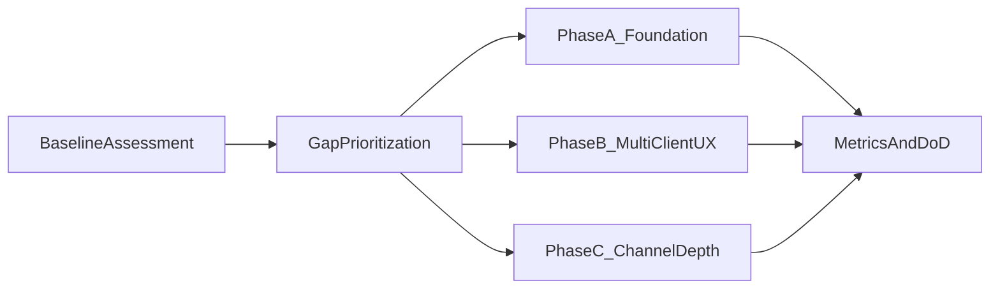

# OpenClaw-Py 平台客户端提升计划（0304）

> 日期：2026-03-04  
> 适用范围：`openclaw-py` 平台客户端建设（Flet 多端 UI + 渠道客户端能力层）  
> 技术主线：**Flet 为唯一长期 UI 主线**，结合 `flutter_app/` 的视觉与交互设计反哺

---

## 1. 背景与目标

`openclaw-py` 当前已经具备跨平台 UI 基础（Flet）和多消息渠道能力，但在“多端体验一致性、渠道能力深度、配置与能力模型统一化”方面仍有提升空间。  
本计划目标是在不引入第二套长期 UI 代码基座的前提下，完成以下三件事：

1. 夯实多端客户端基础能力（Web/Desktop/Android/iOS）与 Gateway 一体化运行体验。
2. 对齐核心渠道客户端能力（Typing/Placeholder/Reaction/Media/Voice）并形成可观测指标。
3. 建立平台能力矩阵与阶段化实施路径，可直接用于 1-2 个月排期执行。

---

## 2. 范围与约束

### 2.1 计划范围

- **平台客户端（UI）**：`src/pyclaw/ui/`、`flet_app.py`
- **渠道客户端（Channel）**：`src/pyclaw/channels/`、`src/pyclaw/channels/plugins/catalog.py`
- **网关承载层**：`src/pyclaw/gateway/`
- **配置与能力声明**：`src/pyclaw/config/schema.py`、catalog/schema 元数据

### 2.2 关键约束

- 以 **Flet** 为主线，不建设并维护独立 Flutter 业务实现。
- `flutter_app/` 仅作为视觉语言、交互动效、组件模式参考。
- Gateway 协议继续保持 v3 兼容，避免破坏已接入客户端。

---

## 3. 三方实现对比（picoclaw / openclaw / openclaw-py）

## 3.1 平台覆盖与客户端形态

| 维度 | picoclaw | openclaw | openclaw-py（当前） |
|------|----------|----------|----------------------|
| 主要形态 | CLI + Web Launcher + TUI + 多渠道 | Web Control UI + iOS + Android + macOS + TUI | Flet 多端 UI + CLI + 多渠道 |
| UI 技术主线 | 原生 HTML/JS + TUI | Lit（Web）+ Swift/Kotlin 原生 | Flet（跨平台） |
| 移动端策略 | 无原生 App | 原生 iOS/Android | Flet 构建 APK/IPA |
| 网关协议 | 内部消息总线 + HTTP/Webhook | WebSocket v3 | WebSocket v3 |
| 客户端成熟度 | 渠道能力丰富，UI 工程化较弱 | 多端成熟，测试体系完整 | 架构完善，体验和能力深度待强化 |

## 3.2 渠道能力模型对比

| 维度 | picoclaw | openclaw | openclaw-py（当前） |
|------|----------|----------|----------------------|
| 能力接口抽象 | `Typing/Placeholder/Reaction/Media` 可选接口 | channel-capabilities + extension metadata | `ChannelPlugin` + plugin sdk + catalog |
| 核心渠道深度 | Telegram/Discord/Slack 细节较完整 | 26+ 插件，能力声明较系统 | 25+ 渠道实现，能力深度不均 |
| 配置驱动程度 | Launcher schema 驱动较明显 | schema 与扩展清单较成熟 | `ChannelsConfig` 与实际渠道覆盖有差距 |
| 语音能力 | Telegram 等侧重语音转写 | 客户端有语音生态 | UI/Discord/voice_call 有基础，统一策略不足 |

## 3.3 对 openclaw-py 的直接启发

1. 能力声明要“单一真源”（catalog/schema）并可被 UI 与运行时同时消费。
2. 平台客户端展示应以“能力矩阵”驱动，而不是硬编码通道列表。
3. 核心渠道先做深（Telegram/Discord/Slack/WhatsApp/Signal），再做广。

---

## 4. openclaw-py 差距清单（按优先级）

## 4.1 P0（必须先收敛）

1. **Gateway-Channel 一体化运行体验不足**  
   - `channels.list` 依赖运行时注入 `ChannelManager`，在非一体化模式下容易空列表。
2. **ChannelsConfig 覆盖不完整**  
   - 配置模型对部分已实现渠道缺少显式字段或统一扩展表达。
3. **平台状态可观测性不足**  
   - 缺少“客户端-网关-渠道”端到端关键指标（延迟、成功率、在线率）统一面板。

## 4.2 P1（短周期可见价值）

1. **Flet 多端体验一致性不够**（响应式、权限、通知、离线状态、布局一致性）。
2. **核心渠道能力不齐**（Typing/Placeholder/Reaction/Media/Voice 在不同渠道不一致）。
3. **UI 与能力声明耦合不足**（渠道面板信息粒度与实际 capability 不完全对应）。

## 4.3 P2（中期可维护性）

1. catalog/schema 未形成单一数据源（易漂移）。
2. 插件/渠道能力声明缺少统一 DoD（Definition of Done）模板。
3. 平台功能验收标准与回归基线尚未工程化。

---

## 5. 平台能力矩阵（目标态）

| 平台 | Chat 流式 | Session 管理 | Channel 状态 | Voice | Notify | 备注 |
|------|-----------|--------------|--------------|-------|--------|------|
| Web（Flet） | 目标完善 | 目标完善 | 目标完善 | 可选 | 需补齐 | 作为最先验收端 |
| Desktop（macOS/Windows/Linux） | 目标完善 | 目标完善 | 目标完善 | 目标完善 | 需补齐 | 托盘/菜单栏统一 |
| Android | 目标完善 | 目标完善 | 目标完善 | 目标完善 | 需补齐 | 权限和后台行为重点 |
| iOS | 目标完善 | 目标完善 | 目标完善 | 目标完善 | 需补齐 | 权限和打包签名重点 |

---

## 6. 核心渠道能力矩阵（第一批）

> 第一批渠道：Telegram / Discord / Slack / WhatsApp / Signal

| 渠道 | Typing | Placeholder | Reaction | Media | Voice | 当前优先级 |
|------|--------|-------------|----------|-------|-------|------------|
| Telegram | 目标对齐 | 目标对齐 | 目标对齐 | 目标对齐 | 目标增强 | P0 |
| Discord | 目标对齐 | 目标对齐 | 目标对齐 | 目标对齐 | 目标增强 | P0 |
| Slack | 目标对齐 | 目标对齐 | 目标对齐 | 目标对齐 | 可选 | P1 |
| WhatsApp | 目标对齐 | 目标对齐 | 目标对齐 | 目标对齐 | 可选 | P1 |
| Signal | 目标对齐 | 目标对齐 | 目标对齐 | 目标对齐 | 可选 | P1 |

---

## 7. 分阶段实施路线（Phase A / B / C）

## 7.1 Phase A（2 周）基础连通与可观测性

### 目标

- 打通“一体化运行 -> UI 可见 -> 渠道可观测”的闭环。
- 修正配置与运行时的关键不一致点，保证基础可用。

### 工作包

1. **一体化运行与 `channels.list` 稳定化**
   - 关键位置：`src/pyclaw/gateway/`、`src/pyclaw/channels/manager.py`
2. **`ChannelsConfig` 完整性治理**
   - 关键位置：`src/pyclaw/config/schema.py`
3. **客户端状态观测基础面板**
   - 关键位置：`src/pyclaw/ui/channels_panel.py`、`src/pyclaw/ui/app.py`
4. **核心链路指标埋点**
   - 指标：连接成功率、消息成功率、P95 首 token 延迟

### DoD

- Web/Desktop 下 `channels.list` 非空率达到目标阈值（联调场景）。
- 配置模型与首批核心渠道一致，启动无 schema 兼容阻塞。
- UI 可查看关键平台/渠道状态。

## 7.2 Phase B（2-4 周）多端体验提升（Flet + Flutter 设计反哺）

### 目标

- 在 Flet 单主线下提升多端体验一致性与设计完成度。

### 工作包

1. **响应式布局与交互一致性**
   - 关键位置：`src/pyclaw/ui/app.py`、`src/pyclaw/ui/theme.py`
2. **设计反哺增强**
   - 关键位置：`src/pyclaw/ui/shimmer.py`、`src/pyclaw/ui/theme.py`、`flutter_app/`（参考）
3. **语音/权限/通知能力梳理**
   - 关键位置：`src/pyclaw/ui/voice.py`、`src/pyclaw/ui/permissions.py`
4. **工具栏与菜单栏统一接入**
   - 关键位置：`src/pyclaw/ui/toolbar.py`、`src/pyclaw/ui/menubar.py`

### DoD

- Web/Desktop/Android/iOS 四端核心流程一致可用。
- 响应式断点、主题、基础动效通过回归清单。
- 平台权限提示与异常路径可控。

## 7.3 Phase C（4 周+）渠道能力深水区与生态一致性

### 目标

- 建立渠道能力统一声明与验收机制，提升长期可维护性。

### 工作包

1. **首批核心渠道能力补齐**
   - 关键位置：`src/pyclaw/channels/*/channel.py`
2. **catalog/schema 单一真源建设**
   - 关键位置：`src/pyclaw/channels/plugins/catalog.py`、`src/pyclaw/config/schema.py`
3. **插件能力声明模板化**
   - 输出统一字段：能力、限制、依赖、稳定性等级
4. **跨端回归基线与测试矩阵**
   - 聚焦 Gateway v3 协议兼容与端到端消息流

### DoD

- 首批核心渠道能力矩阵达标。
- catalog/schema 漂移问题收敛（新增渠道按模板接入）。
- 回归基线可复用，版本迭代成本下降。

---

## 8. 优先级与时间线（P0 / P1 / P2）

| 优先级 | 时间窗 | 目标摘要 | 对应阶段 |
|--------|--------|----------|----------|
| P0 | 第 1-2 周 | 连通性、配置一致性、基础观测能力 | Phase A |
| P1 | 第 3-6 周 | 多端体验一致性、核心渠道能力对齐 | Phase B + Phase C（前半） |
| P2 | 第 7 周起 | 元数据统一、插件声明规范、回归工程化 | Phase C（后半） |

---

## 9. 验收指标（可量化）

## 9.1 功能指标

- **渠道在线率**：核心渠道在目标环境的在线率达到基线目标。
- **消息成功率**：核心链路（接收 -> 路由 -> 回复）成功率达到基线目标。
- **流式时延**：`chat.send` 到首 token 的 P95 延迟可观测并持续下降。
- **跨端一致性**：四端核心流程通过率达到基线目标。

## 9.2 质量指标

- **测试覆盖提升**：平台关键路径新增回归测试并纳入 CI。
- **打包成功率**：`flet build web/macos/windows/linux/apk/ipa` 建立周期性验证。
- **兼容性稳定**：Gateway v3 协议回归通过率稳定。

---

## 10. 风险与缓解策略

| 风险 | 影响 | 缓解策略 |
|------|------|----------|
| 平台权限差异（Android/iOS/Desktop） | 功能行为不一致 | 建立平台权限矩阵与降级路径（可用性优先） |
| 第三方渠道 SDK 不稳定 | 通道异常、升级风险 | 核心渠道锁版本 + 灰度升级 + 回滚预案 |
| 协议兼容漂移（多端实现差异） | 客户端联调失败 | 统一协议样例与回归用例，版本门禁 |
| catalog/schema 双源维护 | 能力声明不一致 | 推进单一真源，增加 schema 校验脚本 |

---

## 11. 实施组织建议（按季度/迭代追踪）

每个迭代任务建议以统一模板记录：

- **Owner 类型**：UI、Channel、Gateway、QA
- **依赖项**：配置变更、SDK 升级、平台证书/签名
- **完成定义 DoD**：功能、测试、文档、回滚方案齐全
- **产出物**：代码 PR、验证报告、指标快照、发布说明

---

## 12. 与现有文档关系

- UI 主线与设计反哺：[`ui_upgrade_plan.md`](./ui_upgrade_plan.md)
- 功能差距基线：[`gap-analysis.md`](./gap-analysis.md)
- 后续实施阶段拆解：[`implement_plan_next.md`](./implement_plan_next.md)
- 架构全景：[`../architecture.md`](../architecture.md)

---

## 13. 计划可视化

---

## 14. 实施记录

### P0 实施完成（2026-03-04）

| 项目 | 改动文件 | 说明 |
|------|----------|------|
| Gateway-Channel 一体化运行 | `gateway/methods/channels.py`, `registration.py`, `channels/manager.py` | `channels.list` 无 ChannelManager 时回退配置读取 + catalog 元数据；runtime 合并 catalog 与运行时能力检测；新增 `record_channel_metric()` 指标埋点 |
| ChannelsConfig 完整性 | `config/schema.py` | 补齐 feishu/matrix/line/irc/msteams/mattermost/twitch/bluebubbles/nostr/nextcloud/synology/tlon/zalo/zalouser/voice_call/onebot 共 16 个字段 |
| 平台状态可观测性 | `ui/channels_panel.py`, `ui/app.py` | 渠道面板新增汇总统计、capability badges、metrics 行；app.py 回退发现覆盖全部配置字段 |

### P1 实施完成（2026-03-04）

| 项目 | 改动文件 | 说明 |
|------|----------|------|
| 多端响应式布局 | `ui/app.py` | 三档断点（Mobile <600 / Tablet <900 / Desktop >=1200）；Mobile 底部 NavigationBar + 隐藏侧栏/菜单栏 |
| toolbar/menubar 接入 | `ui/app.py` | 顶栏展示 menubar + toolbar + gateway indicator，移动端自动隐藏 menubar |
| 权限与通知增强 | `ui/permissions.py` | 新增 BACKGROUND_REFRESH、PERMISSION_EXPLANATIONS、平台差异化权限矩阵；`build_permission_guard_panel()` 移动端引导面板 |
| 渠道能力对齐 | `channels/base.py`, `channels/plugins/catalog.py` | 新增 6 个 runtime_checkable Protocol；`detect_capabilities()` + `ChannelCapabilities`；catalog 从 6 项扩展到 20 项 |
| UI catalog 驱动展示 | `ui/channels_panel.py`, `gateway/methods/channels.py` | 面板以 catalog capabilities 驱动 badge 展示；gateway 合并 catalog + runtime 能力到响应 |

### P2 实施完成（2026-03-04）

| 项目 | 改动文件 | 说明 |
|------|----------|------|
| catalog/schema 单一真源 | `channels/plugins/catalog.py` | 新增 `validate_against_schema()` 和 `validate_against_implementations()` 方法；补齐 nextcloud/synology/tlon/zalo/zalouser/webchat/onebot 共 8 个缺失的 catalog 条目，catalog 总数从 20 提升到 28，与 schema 和实现完全对齐 |
| 插件能力声明模板化 | `channels/base.py` | 新增 `StabilityLevel` 枚举（stable/beta/alpha/experimental）、`ChannelMeta` 结构化元数据模板（版本/作者/依赖/连接方式等）；`ChannelPlugin` 新增 `meta` 属性和 `dod_report()` DoD 质量检查方法 |
| 回归基线与测试矩阵 | `tests/test_catalog_schema_alignment.py`, `tests/test_gateway_channels.py` | 120 个新测试覆盖：catalog↔schema 对齐、catalog↔实现对齐、条目完整性（参数化 26 渠道×4 维度）、ChannelPlugin meta/DoD、gateway channels.list/status handler、指标记录与检索 |

---

## 15. 完成定义

本计划文档完成后，应满足：

1. 可直接指导未来 1-2 个月的平台客户端研发排期。
2. 每个阶段均包含目标、范围、关键文件、指标、风险与缓解策略。
3. 明确坚持“Flet 主线 + Flutter 美化反哺”，不引入第二套长期维护 UI 主线。
