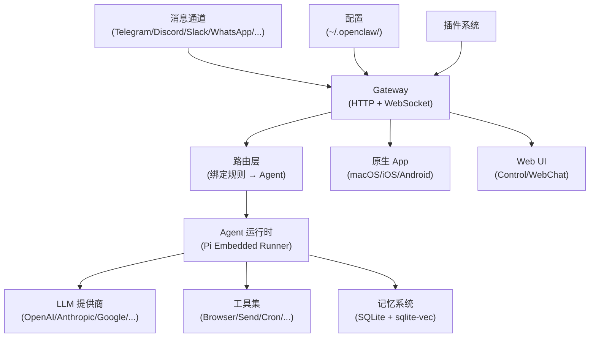
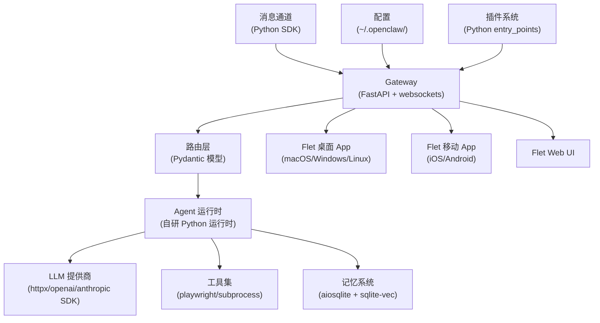
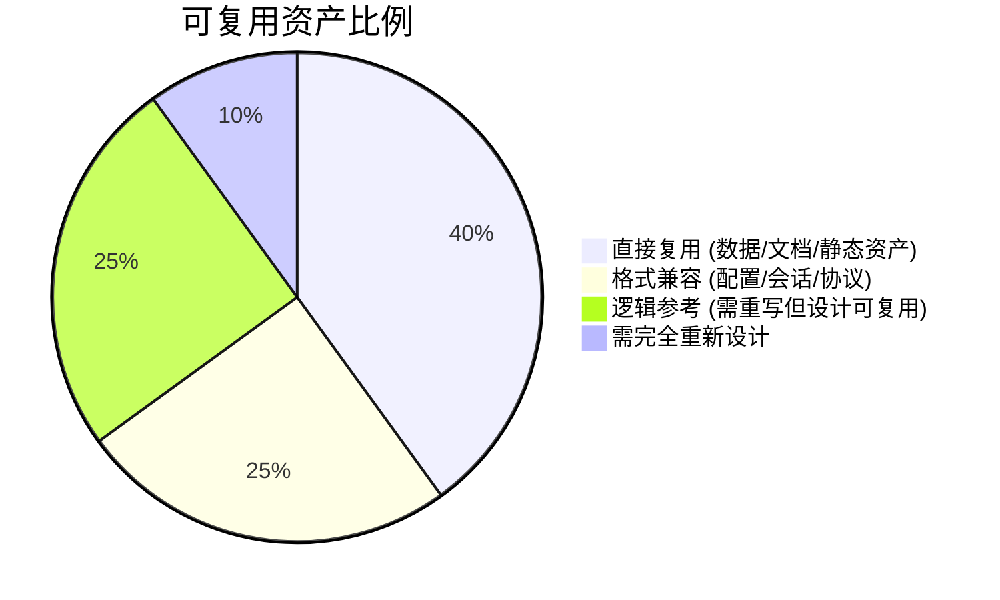
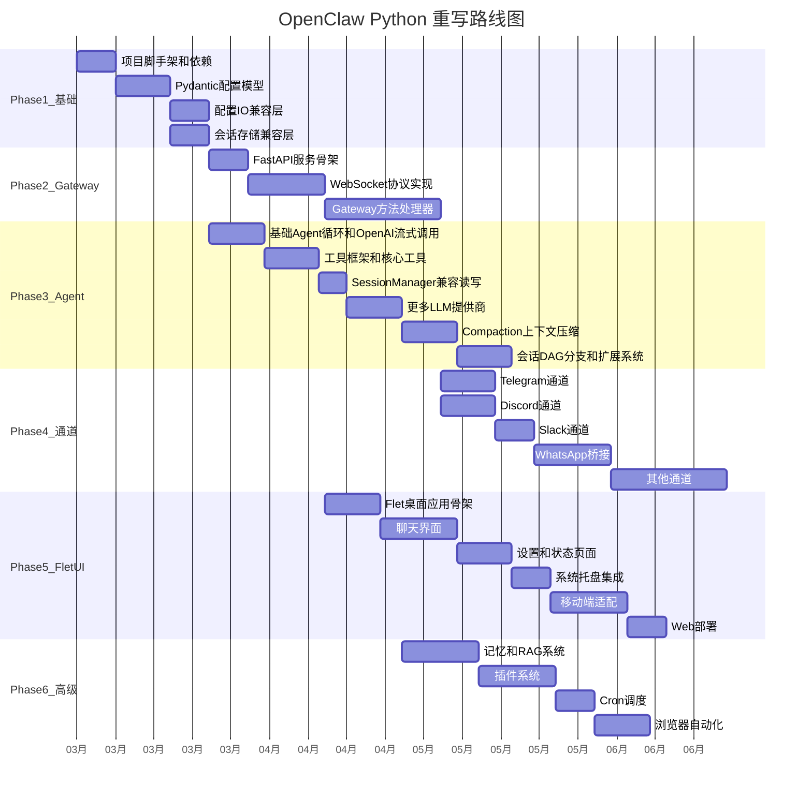

# OpenClaw Python + Flet/Flutter 完整重写方案

## 一、当前架构概览

OpenClaw 是一个多通道 AI 网关，当前技术栈：

- **后端**: TypeScript/Node.js (ESM), Express + WebSocket (`ws`)
- **CLI**: Commander
- **AI 运行时**: Pi embedded runner (`@mariozechner/pi-agent-core`)
- **消息通道**: grammy (Telegram), discord.js, @slack/bolt, Baileys (WhatsApp), signal-cli 等
- **存储**: SQLite (node:sqlite + sqlite-vec), JSON5 配置, JSONL 会话日志
- **原生 App**: SwiftUI (macOS/iOS), Kotlin (Android)
- **Web UI**: Lit Web Components
- **插件系统**: 基于 npm 包的插件 SDK

核心数据流：



## 二、目标架构 (Python + Flet)



## 三、可复用资产清单

以下资产与语言无关，可以直接在 Python 重写中复用：

### 3.1 数据格式和存储 (直接兼容)

这些是重写的最大优势——Python 版本可以无缝读写现有数据：

| 资产 | 路径 | 复用方式 |
|------|------|---------|
| 配置文件 | `~/.openclaw/openclaw.json` (JSON5) | Python `json5` 库直接读写 |
| 会话日志 | `~/.openclaw/agents/*/sessions/*.jsonl` | 逐行 JSON 解析，格式相同 |
| 会话索引 | `~/.openclaw/agents/*/sessions/sessions.json` | 标准 JSON，Pydantic 映射 |
| 认证配置 | `~/.openclaw/credentials/*.json` | 标准 JSON |
| Auth Profiles | `~/.openclaw/agents/*/auth-profiles.json` | 标准 JSON |
| 记忆数据库 | `~/.openclaw/memory/*.sqlite` | SQLite 跨语言兼容 |
| Hooks 配置 | `~/.openclaw/hooks.json5` | JSON5 格式 |
| 允许列表 | `~/.openclaw/credentials/*-allowFrom.json` | 标准 JSON |
| 配对数据 | `~/.openclaw/credentials/*-pairing.json` | 标准 JSON |

### 3.2 WebSocket 协议 (协议层兼容)

| 资产 | 路径 | 复用方式 |
|------|------|---------|
| 协议 JSON Schema | `dist/protocol.schema.json` (需生成) | 可用于生成 Pydantic 模型或运行时校验 |
| 协议 TypeBox 定义 | `src/gateway/protocol/schema/*.ts` | 参考实现，转写为 Pydantic |

协议兼容意味着过渡期间现有的 Swift/Kotlin 原生 App 仍可连接 Python Gateway。

### 3.3 工具和 Agent 元数据

| 资产 | 路径 | 复用方式 |
|------|------|---------|
| 工具显示元数据 | `src/agents/tool-display.json` | 直接加载 (emoji、显示名称) |
| 安全策略 | `src/infra/host-env-security-policy.json` | 直接加载 (屏蔽环境变量列表) |
| A2UI 协议 Schema | `vendor/a2ui/specification/*/json/*.json` | Canvas 协议的标准 JSON Schema |
| 设备标识符映射 | `apps/macos/.../ios-device-identifiers.json` | 设备名称映射表 |
| 设备标识符映射 | `apps/macos/.../mac-device-identifiers.json` | 设备名称映射表 |

### 3.4 文档 (完全复用)

| 资产 | 路径 | 复用方式 |
|------|------|---------|
| Mintlify 文档 | `docs/**/*.md`, `docs/**/*.mdx` | 600+ 文件，全部可复用 |
| 文档配置 | `docs/docs.json` | Mintlify 导航和主题 |
| 中文翻译术语表 | `docs/.i18n/glossary.zh-CN.json` | i18n 复用 |
| 日文翻译术语表 | `docs/.i18n/glossary.ja-JP.json` | i18n 复用 |
| Agent 模板 | `docs/reference/templates/*.md` | AGENTS/TOOLS/IDENTITY 模板 |

### 3.5 Skills 系统 (完全复用)

| 资产 | 路径 | 复用方式 |
|------|------|---------|
| 技能定义 | `skills/**/SKILL.md` | Markdown + YAML frontmatter，与语言无关 |
| 技能参考 | `skills/**/references/*.md` | 参考文档 |
| Shell 脚本技能 | `skills/tmux/scripts/*.sh` | 纯 bash |
| 转录脚本 | `skills/openai-whisper-api/scripts/*.sh` | curl/ffmpeg 封装 |

### 3.6 插件清单格式

| 资产 | 路径 | 复用方式 |
|------|------|---------|
| 插件清单 | `extensions/*/openclaw.plugin.json` (~25个) | JSON 格式，定义通道 ID、配置 schema |

### 3.7 测试契约和数据

| 资产 | 路径 | 复用方式 |
|------|------|---------|
| 审批契约测试 | `test/fixtures/system-run-approval-*.json` | 测试用例数据 |
| 命令契约测试 | `test/fixtures/system-run-command-contract.json` | 测试用例数据 |
| Shell 解析测试 | `test/fixtures/exec-allowlist-shell-parser-parity.json` | 测试用例数据 |
| Exec 解析测试 | `test/fixtures/exec-wrapper-resolution-parity.json` | 测试用例数据 |

### 3.8 GitHub / CI 配置

| 资产 | 路径 | 复用方式 |
|------|------|---------|
| 标签规则 | `.github/labeler.yml` | 路径匹配标签 |
| Issue 模板 | `.github/ISSUE_TEMPLATE/*.yml` | 模板格式 |
| PR 模板 | `.github/pull_request_template.md` | 模板格式 |
| 资金配置 | `.github/FUNDING.yml` | 赞助链接 |

### 3.9 Shell 脚本 (无 Node 依赖)

| 脚本 | 路径 | 用途 |
|------|------|------|
| macOS 日志查询 | `scripts/clawlog.sh` | unified log 查询 |
| DMG 制作 | `scripts/create-dmg.sh` | macOS 安装包 |
| Appcast 签名 | `scripts/make_appcast.sh` | Sparkle 更新签名 |
| Changelog 转换 | `scripts/changelog-to-html.sh` | Changelog 转 HTML |
| 拼写检查 | `scripts/docs-spellcheck.sh` | codespell 运行器 |
| 沙箱构建 | `scripts/sandbox-common-setup.sh` | Docker 构建脚本 |

### 3.10 静态资产

| 资产 | 路径 | 复用方式 |
|------|------|---------|
| Logo/图标 | `docs/assets/pixel-lobster.svg` | 品牌资产 |
| 赞助商 Logo | `docs/assets/sponsors/*.svg` | 静态图片 |
| Favicon | `ui/public/favicon.svg` | Web 图标 |
| 头像占位 | `assets/avatar-placeholder.svg` | UI 资产 |
| Chrome 扩展 | `assets/chrome-extension/manifest.json` | 浏览器扩展清单 |

### 3.11 外部工具/子进程 (调用方式相同)

以下组件在 TypeScript 版本中已经通过 subprocess 调用，Python 版本可以用完全相同的方式：

| 工具 | 调用方式 | 说明 |
|------|---------|------|
| signal-cli | subprocess | Signal 通道 |
| imsg | subprocess | iMessage 通道 (macOS) |
| Playwright | Python 官方 SDK | API 几乎 1:1 |
| Tailscale | subprocess (`tailscale serve/funnel`) | 网络穿透 |
| ffmpeg | subprocess | 媒体处理 |

### 3.12 复用程度总结



- **直接复用 (~40%)**: 文档、Skills、测试数据、静态资产、JSON 元数据、Shell 脚本
- **格式兼容 (~25%)**: 配置文件、会话 JSONL、SQLite 数据库、WebSocket 协议、插件清单
- **逻辑参考 (~25%)**: TypeScript 源码作为设计参考（路由逻辑、投递流程、工具定义）
- **需重新设计 (~10%)**: Pi Agent 运行时、Flet UI（全新 UI 框架）、插件加载机制

## 四、技术选型映射

### 4.1 后端核心

| 模块 | 当前 (TypeScript) | 目标 (Python) | 说明 |
|------|-------------------|---------------|------|
| HTTP 服务 | Express | **FastAPI** | 自带 OpenAPI, async, 性能优秀 |
| WebSocket | `ws` | **websockets** (或 FastAPI WS) | 保持协议兼容 |
| CLI | Commander | **Typer** (基于 Click) | 类型安全, 自动补全 |
| 配置验证 | Zod | **Pydantic v2** | 数据验证 + 序列化 |
| 配置文件 | JSON5 | **json5** (PyPI) | 兼容现有配置 |
| 日志 | tslog | **loguru** | 结构化日志 |
| 任务调度 | croner | **APScheduler** | Cron 调度 |
| 文件监控 | chokidar | **watchdog** | 文件系统事件 |
| 异步运行时 | Node event loop | **asyncio** + **uvloop** | 高性能事件循环 |

### 4.2 AI/Agent 运行时

| 模块 | 当前 | 目标 | 说明 |
|------|------|------|------|
| Agent 核心循环 | pi-agent-core | **自研 Python Agent Runtime** | 流式 LLM + 工具循环 |
| LLM 客户端 | pi-ai (streamSimple) | **httpx** + 官方 SDK | openai, anthropic, google-generativeai |
| 工具框架 | pi-coding-agent tools | **自研工具框架** (Pydantic schema) | JSON Schema 工具定义 |
| 会话管理 | SessionManager (JSONL) | **自研 SessionManager** | 兼容现有 JSONL 格式 |
| 向量搜索 | sqlite-vec (Node) | **sqlite-vec** (Python bindings) | 向量相似度搜索 |
| 浏览器 | playwright-core | **playwright** (Python) | API 几乎相同 |
| TTS | node-edge-tts | **edge-tts** (Python) | 相同底层服务 |

### 4.3 消息通道

| 通道 | 当前 SDK | Python SDK | 成熟度 |
|------|----------|------------|--------|
| Telegram | grammy | **aiogram 3** 或 **python-telegram-bot** | 成熟 |
| Discord | discord.js / @buape/carbon | **discord.py** 或 **nextcord** | 成熟 |
| Slack | @slack/bolt | **slack-bolt** (Python) | 官方 SDK, 成熟 |
| WhatsApp | Baileys | **neonize** (whatsmeow Python 绑定) | 风险点 (见 6.1) |
| Signal | signal-cli (subprocess) | **signal-cli** (同样 subprocess) | 相同 |
| iMessage | imsg (macOS subprocess) | **subprocess** (相同方式) | 相同 |
| Matrix | matrix-nio (extension) | **matrix-nio** | Python 原生, 成熟 |
| Google Chat | gaxios | **google-api-python-client** | 成熟 |
| LINE | @line/bot-sdk | **line-bot-sdk** (Python) | 官方 SDK |
| Feishu/Lark | @larksuiteoapi/node-sdk | **lark-oapi** (Python) | 官方 SDK |

### 4.4 UI (Flet/Flutter)

| 模块 | 当前 | 目标 (Flet) | 说明 |
|------|------|-------------|------|
| macOS 菜单栏 | SwiftUI MenuBarExtra | **Flet desktop** + **pystray** 系统托盘 | Flet 无原生 menubar; pystray 补充 |
| iOS App | SwiftUI | **Flet mobile (iOS)** | Flet 编译为 Flutter iOS |
| Android App | Kotlin | **Flet mobile (Android)** | Flet 编译为 Flutter Android |
| Web UI (Control) | Lit Web Components | **Flet web** | 编译为 Flutter Web |
| WebChat | Lit + Gateway WS | **Flet web** 组件 | 嵌入式聊天 |
| Voice Wake | AVFoundation (macOS/iOS) | 平台限制, 需 **Flutter 插件** | 见风险点 |

## 五、项目结构设计

```
openclaw-py/
├── pyproject.toml              # 项目配置 (hatch/poetry)
├── README.md
├── src/
│   └── openclaw/
│       ├── __init__.py
│       ├── main.py             # 入口
│       ├── cli/                # Typer CLI
│       │   ├── __init__.py
│       │   ├── app.py          # 主命令组
│       │   ├── commands/       # 子命令 (setup, config, agent, status, ...)
│       │   └── progress.py     # 进度显示
│       ├── gateway/            # FastAPI + WebSocket Gateway
│       │   ├── __init__.py
│       │   ├── server.py       # Gateway 服务启动
│       │   ├── http.py         # HTTP 路由
│       │   ├── ws.py           # WebSocket 处理
│       │   ├── protocol/       # 协议定义 (Pydantic 模型)
│       │   │   ├── frames.py   # RequestFrame, ResponseFrame, EventFrame
│       │   │   ├── connect.py  # ConnectParams, HelloOk
│       │   │   └── methods.py  # 方法定义
│       │   ├── methods/        # WS 方法处理器
│       │   │   ├── agent.py
│       │   │   ├── chat.py
│       │   │   ├── config.py
│       │   │   ├── sessions.py
│       │   │   └── ...
│       │   └── node_registry.py
│       ├── agents/             # AI Agent 运行时
│       │   ├── __init__.py
│       │   ├── runner.py       # Agent 执行循环
│       │   ├── stream.py       # LLM 流式调用
│       │   ├── session.py      # SessionManager (JSONL)
│       │   ├── compaction.py   # 上下文压缩
│       │   ├── models/         # LLM 提供商
│       │   │   ├── providers.py
│       │   │   ├── openai.py
│       │   │   ├── anthropic.py
│       │   │   ├── google.py
│       │   │   ├── ollama.py
│       │   │   └── ...
│       │   ├── tools/          # 工具集
│       │   │   ├── base.py     # AgentTool 基类
│       │   │   ├── browser.py
│       │   │   ├── send.py
│       │   │   ├── cron.py
│       │   │   ├── memory.py
│       │   │   ├── web_fetch.py
│       │   │   └── ...
│       │   └── auth/           # 认证配置
│       │       ├── profiles.py
│       │       └── secrets.py
│       ├── channels/           # 消息通道
│       │   ├── __init__.py
│       │   ├── registry.py     # 通道注册表
│       │   ├── dock.py         # ChannelDock
│       │   ├── telegram/
│       │   ├── discord/
│       │   ├── slack/
│       │   ├── whatsapp/
│       │   ├── signal/
│       │   └── ...
│       ├── routing/            # 消息路由
│       │   ├── resolve.py
│       │   ├── session_key.py
│       │   └── bindings.py
│       ├── config/             # 配置管理
│       │   ├── __init__.py
│       │   ├── schema.py       # Pydantic 配置模型
│       │   ├── io.py           # 加载/保存
│       │   ├── paths.py        # 路径常量
│       │   └── sessions/       # 会话存储
│       ├── memory/             # 记忆/RAG
│       │   ├── manager.py
│       │   ├── embeddings.py
│       │   └── sqlite_vec.py
│       ├── media/              # 媒体处理
│       │   ├── store.py
│       │   ├── fetch.py
│       │   └── image_ops.py
│       ├── infra/              # 基础设施
│       │   ├── delivery.py     # 消息投递
│       │   ├── retry.py
│       │   └── tailscale.py
│       ├── plugins/            # 插件系统
│       │   ├── sdk.py          # 插件 SDK
│       │   ├── loader.py       # 插件加载 (entry_points)
│       │   └── hooks.py        # Hook 系统
│       └── cron/               # 定时任务
│           ├── scheduler.py
│           └── runner.py
├── ui/                         # Flet UI 应用
│   ├── __init__.py
│   ├── app.py                  # Flet 主应用
│   ├── desktop/                # 桌面特定
│   │   ├── tray.py             # 系统托盘 (pystray)
│   │   └── menubar.py
│   ├── mobile/                 # 移动端特定
│   │   └── permissions.py
│   ├── pages/                  # 页面
│   │   ├── chat.py             # 聊天界面
│   │   ├── settings.py         # 设置
│   │   ├── channels.py         # 通道管理
│   │   ├── sessions.py         # 会话列表
│   │   ├── agents.py           # Agent 管理
│   │   └── status.py           # 状态面板
│   ├── components/             # 可复用组件
│   │   ├── message_bubble.py
│   │   ├── sidebar.py
│   │   ├── toolbar.py
│   │   └── ...
│   └── theme.py                # 主题/配色
├── extensions/                 # 插件/扩展
│   ├── msteams/
│   ├── matrix/
│   ├── zalo/
│   └── ...
└── tests/
    ├── test_gateway.py
    ├── test_agent.py
    ├── test_channels/
    └── ...
```

## 六、关键风险点和解决方案

### 6.1 WhatsApp -- 高风险

Baileys 是 Node.js 专有库，Python 生态没有同等成熟的替代品。

**方案**: 使用 [neonize](https://github.com/krypton-byte/neonize) (Go whatsmeow 的 Python 绑定)

- neonize 基于 Go 的 whatsmeow 库，通过 Python C 扩展调用，纯 Python 安装
- 支持多设备、消息收发、媒体、群组等核心功能
- 风险：成熟度低于 Baileys，需要充分测试边缘 case
- 备选：如果 neonize 不满足需求，可考虑基于 whatsmeow 自行编写 Python 绑定 (via pybindgen / cffi)

### 6.2 Agent Runtime -- Python 完全重写

#### 原始代码量参考

| 包 | 估算 LOC | 功能 |
|----|---------|------|
| `pi-agent-core` | ~1,000 | Agent 循环、事件流、工具执行调度 |
| `pi-ai` | ~4,500 | 多 LLM 提供商流式调用 (SSE 解析) |
| `pi-coding-agent` | ~15,000 | AgentSession、SessionManager、Compaction、Extensions、工具 |
| **总计** | **~20,500** | |

Python 重写后预计 ~10,000-15,000 行（Python 官方 LLM SDK 封装更好，省去大量 SSE 解析代码）。

#### 重写优势

- Python 官方 LLM SDK (`openai`, `anthropic`, `google-generativeai`) 已内置流式 + 工具调用，无需手写 SSE 解析
- 核心 agent loop 本质简单：`prompt → 调 LLM → tool_use → 执行工具 → 返回结果 → 循环`
- `asyncio` + `async for` 天然适合流式 agent 循环
- 不使用 LangChain / LangGraph（保持会话格式兼容、减少依赖、核心代码量可控）

#### 分 6 个子阶段渐进实施

| 子阶段 | 内容 | 里程碑 |
|--------|------|--------|
| Phase 3a | 基础 Agent 循环 + OpenAI/Anthropic 流式调用 | 可以对话 |
| Phase 3b | 工具框架 + 核心工具 (send, web_fetch, browser) | 可以使用工具 |
| Phase 3c | SessionManager (JSONL 兼容读写) | 会话持久化 |
| Phase 3d | 更多 LLM 提供商 (Google, Ollama, Bedrock) | 多模型支持 |
| Phase 3e | Compaction (上下文压缩: token 计数 + 摘要) | 长对话支持 |
| Phase 3f | 会话 DAG 分支 + 扩展系统 | 完整功能 |

Phase 3a + 3b + 3c 完成后即有一个可用的 Agent 运行时。

#### 核心 Agent 循环骨架

```python
from typing import AsyncIterator
from dataclasses import dataclass

@dataclass
class AgentEvent:
    type: str  # "message_start" | "message_update" | "message_end" | "tool_start" | "tool_end" | "agent_end"
    delta: str | None = None
    name: str | None = None
    result: dict | None = None

async def run_agent(
    prompt: str,
    session: SessionManager,
    tools: list[AgentTool],
    model: ModelConfig,
) -> AsyncIterator[AgentEvent]:
    """核心 agent 循环: 流式 LLM + 工具执行"""
    messages = await session.load_messages()
    messages.append({"role": "user", "content": prompt})

    while True:
        yield AgentEvent(type="message_start")

        # 流式调用 LLM (使用官方 SDK, 无需手写 SSE)
        response = await stream_llm(model, messages, tools)
        for chunk in response:
            yield AgentEvent(type="message_update", delta=chunk.text)

        assistant_msg = collect_response(response)
        messages.append(assistant_msg)
        await session.append_message(assistant_msg)

        tool_calls = extract_tool_calls(assistant_msg)
        if not tool_calls:
            yield AgentEvent(type="message_end")
            break

        for tc in tool_calls:
            yield AgentEvent(type="tool_start", name=tc.name)
            result = await execute_tool(tools, tc)
            yield AgentEvent(type="tool_end", result=result)
            tool_msg = tool_result_message(tc.id, result)
            messages.append(tool_msg)
            await session.append_message(tool_msg)

    yield AgentEvent(type="agent_end")
```

这个骨架约 50 行。加上错误处理、重试、abort 支持、auth profile 轮转等，完整版约 500-800 行 -- 远小于 Pi 运行时的 20,500 行。

#### 为什么不用 LangChain / LangGraph

- 需保持与现有 JSONL 会话格式兼容
- LangChain 的抽象层过重，运行时开销大
- 自研循环代码量小（核心 <1,000 行），完全可控
- 避免引入大型框架依赖和升级风险

### 6.3 macOS 系统托盘 / 菜单栏 -- 中等风险

Flet 不直接支持 macOS MenuBarExtra 风格的菜单栏应用。

**方案**: 组合使用

- **pystray** 提供系统托盘图标和菜单
- **Flet** 提供主窗口 UI（点击托盘图标弹出）
- 或者对 macOS 保留一个轻量 Swift wrapper 来管理 menubar，通过 subprocess 启动 Flet

### 6.4 Voice Wake / PTT -- 高风险

语音唤醒和按键通话需要平台原生 API（AVFoundation, AudioRecord）。

**方案**:

- **桌面**: 使用 `sounddevice` + `vosk`/`whisper` 做语音检测
- **移动端**: 需要写 Flutter 原生插件 (Dart)，Flet 支持自定义 Flutter 包
- 或者降级：移动端暂不支持 Voice Wake，仅支持按钮触发

### 6.5 性能考虑

Python 的 I/O 性能低于 Node.js，但 AI 网关的瓶颈在 LLM API 延迟，不在本地 I/O。

**措施**:

- 全面使用 `async/await` + `uvloop`
- 数据库操作用 `aiosqlite`
- HTTP 用 `httpx` (async)
- WebSocket 用 `websockets` 库 (高性能)

## 七、分阶段实施路线



## 八、Phase 1 详细实施 (建议立即开始)

### 1. 初始化项目

```bash
mkdir openclaw-py && cd openclaw-py
# 使用 hatch 或 poetry
pip install hatch
hatch new --init
```

`pyproject.toml` 核心依赖:

```toml
[project]
name = "openclaw"
requires-python = ">=3.12"
dependencies = [
    "fastapi>=0.115",
    "uvicorn[standard]>=0.34",
    "websockets>=14",
    "typer>=0.15",
    "pydantic>=2.10",
    "httpx>=0.28",
    "json5>=0.10",
    "aiosqlite>=0.21",
    "loguru>=0.7",
    "apscheduler>=4",
    "watchdog>=6",
    "pystray>=0.19",
    "Pillow>=11",
    "flet>=0.27",
    "edge-tts>=7",
    "openai>=1.60",
    "anthropic>=0.42",
    "google-generativeai>=0.8",
    "aiogram>=3.17",
    "discord.py>=2.4",
    "slack-bolt>=1.22",
    "playwright>=1.50",
]
```

### 2. 配置兼容层 (第一个要实现的模块)

读取现有 `~/.openclaw/openclaw.json` (JSON5 格式) 并映射到 Pydantic 模型：

```python
# src/openclaw/config/schema.py
from pydantic import BaseModel, ConfigDict, Field
from typing import Optional, Union

class SecretRef(BaseModel):
    source: str  # "env" | "file" | "exec"
    provider: str
    id: str

class ModelDefinition(BaseModel):
    model_config = ConfigDict(populate_by_name=True)

    id: str
    name: str
    reasoning: Optional[bool] = None
    context_window: Optional[int] = Field(None, alias="contextWindow")
    max_tokens: Optional[int] = Field(None, alias="maxTokens")

class ModelProvider(BaseModel):
    model_config = ConfigDict(populate_by_name=True)

    base_url: str = Field(alias="baseUrl")
    api_key: Optional[Union[str, SecretRef]] = Field(None, alias="apiKey")
    api: Optional[str] = None
    models: list[ModelDefinition] = []

class OpenClawConfig(BaseModel):
    model_config = ConfigDict(populate_by_name=True)

    models: Optional[dict[str, ModelProvider]] = None
    # ... 完整映射现有配置结构
```

### 3. 会话 JSONL 兼容层

```python
# src/openclaw/agents/session.py
import json
import aiofiles
from pathlib import Path

class SessionManager:
    def __init__(self, path: Path):
        self.path = path
        self.messages: list[dict] = []

    async def load(self) -> None:
        """加载现有 JSONL 会话文件 (兼容 TypeScript 版本格式)"""
        if self.path.exists():
            async with aiofiles.open(self.path) as f:
                async for line in f:
                    line = line.strip()
                    if not line:
                        continue
                    entry = json.loads(line)
                    if entry.get("type") == "message":
                        self.messages.append(entry["message"])

    async def append(self, entry: dict) -> None:
        """追加条目到 JSONL"""
        async with aiofiles.open(self.path, "a") as f:
            await f.write(json.dumps(entry, ensure_ascii=False) + "\n")
```

## 九、关键设计决策总结

1. **协议兼容**: 保持 WebSocket 协议 v3 完全兼容，使现有 macOS/iOS/Android 原生 App 在过渡期可以连接 Python Gateway
2. **配置兼容**: 直接读取 `~/.openclaw/` 下的 JSON5 配置和 JSONL 会话，无需迁移
3. **WhatsApp**: 使用 neonize (whatsmeow Python 绑定) 实现纯 Python WhatsApp 通道
4. **Agent 运行时**: Python 完全重写。使用官方 LLM SDK (`openai`, `anthropic`, `google-generativeai`)，不使用 LangChain。分 6 个子阶段渐进实施，Phase 3a-3c 完成后即有可用运行时
5. **插件系统**: 使用 Python `entry_points` 机制（类似 pytest 插件发现），保持接口与 TypeScript 版语义对齐
6. **Flet UI**: 单一代码库覆盖 Web/Desktop/Mobile，macOS 系统托盘用 pystray 补充
7. **渐进迁移**: 可以模块化替换（先替换 Gateway，通道逐个迁移，UI 最后替换）

## 十、实施优先级

按依赖关系和价值排序，建议的实施顺序：

1. **Phase 1 (基础)** → 脚手架、Pydantic 配置模型、配置 IO 兼容层、会话存储兼容层
2. **Phase 3a-3c (Agent MVP)** → 基础 Agent 循环、工具框架、SessionManager -- 完成后即可本地对话
3. **Phase 2 (Gateway)** → FastAPI 服务、WebSocket 协议、方法处理器 -- 完成后可远程访问
4. **Phase 4 (通道)** → Telegram 优先，然后 Discord、Slack，最后 WhatsApp 和其他
5. **Phase 5 (Flet UI)** → 桌面聊天界面优先，然后设置/状态页、系统托盘、移动端、Web
6. **Phase 3d-3f (Agent 完善)** → 更多 LLM 提供商、Compaction、DAG 分支
7. **Phase 6 (高级)** → 记忆/RAG、插件系统、Cron、浏览器自动化
