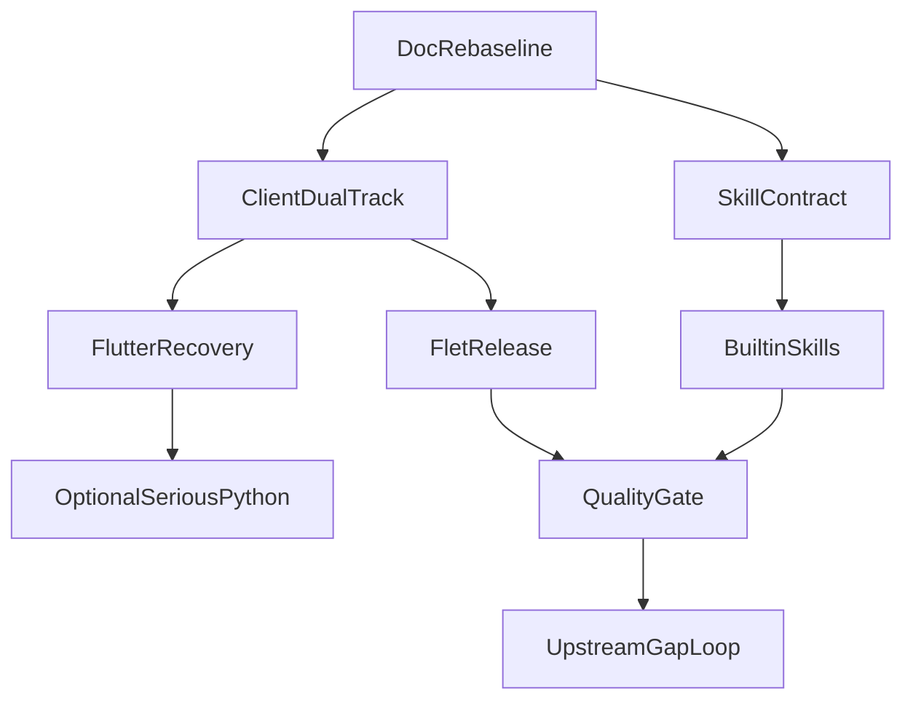

# 规整表格与决策矩阵（唯一真源）

> 最后更新：2026-03-15  
> 本文定位：**决策视角**（矩阵、边界、依赖、指标、风险）  
> 执行进度与周看板：见 `reference/PROGRESS.md`

---

## 1) 文档边界与使用方式

| 文档 | 关注点 | 更新节奏 |
|---|---|---|
| `PROGRESS.md` | 做什么、做到哪、下一步、阻塞点 | 周更/里程碑变更时更新 |
| `REFERENCE_TABLES.md`（本文） | 为什么这么做、如何划分、怎么验收 | 决策变更时更新 |

### 1.1 本文强约束

- 所有长期规划以本矩阵为准，避免多文档冲突。
- 若执行与矩阵不一致，先更新矩阵再推进实现。
- Skills、双客户端、发布、上游追踪四条主线必须同时可追踪。

---

## 2) 能力差距矩阵（对齐 OpenClaw）

> 参考来源（长期跟踪）：  
> - [openclaw/openclaw](https://github.com/openclaw/openclaw)  
> - [docs.openclaw.ai](https://docs.openclaw.ai/)

| 领域 | 上游能力信号 | 本项目现状 | 差距等级 | 计划动作 |
|---|---|---|---|---|
| Browser 会话与 attach | release 持续增强（现有会话 attach、自动化批量动作） | 已有 Playwright 薄适配与 RPC | P1 | 增加 profile 生命周期审计、跨会话恢复策略 |
| 控制面 UX（Dashboard v2） | 上游控制台持续迭代 | Flet 控制面丰富，但与上游能力命名不完全同构 | P2 | 建立“能力映射表”防 UI 能力漂移 |
| Provider 插件化 | 上游 fast mode + provider 插件持续扩展 | Provider 数量多，治理规则弱 | P1 | 建立 provider capability registry + 健康探测门禁 |
| 安全热修复同步 | 上游高频安全修复（WS 来源校验等） | 已有 hardening 模块 | P0 | 设立周度安全对齐清单和回归用例 |
| 配置校验与迁移 | 上游 config validate/migrate 持续完善 | 已有 validate/migrations | P1 | 建立“文档键名-代码键名”自动契约测试 |
| SecretRef/凭证治理 | 上游 SecretRef 范围广 | 具备 secrets 模块 | P1 | 收敛明文凭证路径与审计报告模板 |
| 通道策略一致性 | 上游多通道 DM/group 策略细化 | 通道能力多但深度不均 | P1 | 统一 channel capability DoD 与验收脚本 |
| Nodes/移动端能力 | 上游节点侧能力扩展快 | 本项目已实现较多能力 | P2 | 明确“核心/可选”能力分层，控制复杂度 |
| 备份/运维命令 | 上游 backup 与运维文档完善 | 具备备份链路 | P2 | 增加发布前备份恢复演练门禁 |
| 上游追踪机制 | 上游变化快 | 追踪依赖人工 | P0 | 建立固定节奏的差距评估与归档机制 |

---

## 3) Skills 兼容矩阵（Python / Node / MCP）

### 3.1 运行时契约（Skill Runtime Contract）

| 维度 | 字段 | 说明 | 约束 |
|---|---|---|---|
| spec | `skill_key`, `description`, `version` | 技能标识与版本 | 必填 |
| runtime | `python-native` / `node-wrapper` / `mcp-bridge` | 技能执行路径 | 必填 |
| capability | `tools`, `inputs`, `outputs` | 能力声明 | 必填 |
| deps | `python`, `node`, `binary`, `mcp` | 依赖声明 | 必填 |
| security | `security_level`, `requires_approval`, `network_policy` | 安全与审批 | 必填 |
| lifecycle | `install`, `healthcheck`, `rollback` | 运维动作 | 必填 |
| observability | `metrics`, `logs`, `trace_tags` | 可观测字段 | 推荐 |

### 3.2 兼容路径矩阵

| 类型 | 适用场景 | 优点 | 风险 | 约束策略 |
|---|---|---|---|---|
| Python-native | 本地工具与数据处理 | 集成最深、性能稳定 | 依赖冲突 | venv/extra 分层 + import 检测 |
| Node-wrapper | 复用 TS/Node 生态技能 | 可快速迁移上游技能 | 进程与安全复杂 | 受控 exec + allowlist + timeout + sandbox |
| MCP-bridge | 远程/独立服务能力 | 解耦好、跨语言统一 | 网络与可用性依赖外部 | healthcheck + 重试 + 降级策略 |

### 3.3 首批内置技能路线

| 技能 | 目标 | 运行时 | 优先级 | 验收标准 |
|---|---|---|---|---|
| `repo-review` | 代码审查与风险清单 | Python-native | P0 | 能输出结构化 findings + 严重级别 |
| `docs-sync` | 文档与实现一致性巡检 | Python-native | P0 | 发现键名/API 漂移并给出修复建议 |
| `release-helper` | 发布检查与变更汇总 | Python-native + MCP | P1 | 自动生成发布 gate 报告 |
| `incident-triage` | 故障分诊与应急模板 | Python-native | P1 | 可生成应急处置清单 |
| `office-reader` | PDF/DOCX/XLSX/PPTX 抽取 | Python-native | P1 | 多格式输入稳定解析 |
| `channel-ops` | 通道健康与策略巡检 | Python-native | P1 | 可输出通道能力/风险报告 |
| `node-toolchain` | Node 生态技能桥接 | Node-wrapper | P2 | 受控执行 + 安全审计完整 |
| `mcp-admin` | MCP 服务治理 | MCP-bridge | P2 | 支持连接、探活、降级、告警 |

### 3.4 Skills 生命周期门禁

| 阶段 | 必做项 | 产出 |
|---|---|---|
| Design | 契约字段定义、权限边界 | Skill Spec 草案 |
| Build | 依赖检测、执行器适配、错误降级 | 可安装技能包 |
| Verify | 单测 + 集成 + 安全审计 | 验证报告 |
| Release | 版本、变更记录、回滚策略 | 发布记录 |
| Operate | 健康检查、错误率、使用率追踪 | 运维看板 |

### 3.5 Code Review 结论与已落地修复（2026-03-15）

| 发现项 | 风险 | 处置 |
|---|---|---|
| `pyclaw skills run` 未执行运行时契约门禁（`runtime_contract`） | 技能声明与真实执行行为不一致，可能绕过依赖/权限预期 | 已在 `src/pyclaw/agents/skills/runner.py` 增加执行前预检，缺依赖与不可调用策略默认阻断 |
| 非用户可调用技能（`userInvocable: false`）缺少 CLI 阻断 | 内部技能可能被直接触发 | 已增加 `skill_not_user_invocable` 阻断返回 |
| 探测型技能（`mcp-admin`/`node-toolchain`）需保留故障态可执行 | 若强阻断会损失诊断能力 | 已按技能类型豁免预检阻断，仍由技能自身输出 `blocking_items` |

> 对应验证：`tests/pyclaw/cli/test_skills_run.py` 新增契约阻断/绕过/调用策略用例，回归通过。

### 3.6 UI 质量门禁补齐（2026-03-15）

| 发现项 | 风险 | 处置 |
|---|---|---|
| UI E2E 仅占位（未执行真实浏览器链路） | 页面可启动但关键加载失败无法在 CI 暴露 | 已将 `tests/pyclaw/ui/e2e/test_ui_web_smoke.py` 改为真实 smoke（启动 `pyclaw ui --web` + Playwright 打开页面），并保持 `PYCLAW_RUN_UI_E2E` 开关 |
| 缺少长时抖动重连恢复自动化验证 | 网络抖动下可能出现重连循环不收敛 | 已新增 `GatewayClient` 重连恢复测试，覆盖“多次失败后恢复 connected”路径 |
| UI E2E 无固定执行节奏 | 回归依赖人工触发，风险累积 | CI 新增 `ui-e2e-nightly` 定时作业，每日执行真实 web smoke |

---

## 4) 双客户端职责矩阵（Flet vs Flutter）

### 4.1 角色定位

| 维度 | Flet 线（稳定生产） | Flutter 线（增强体验） |
|---|---|---|
| 战略定位 | 默认主入口 | 增强与实验先行 |
| 交付目标 | 跨平台稳定可用 | 高交互场景与体验提升 |
| 变更节奏 | 稳定迭代 | 里程碑式恢复 |
| 与 Gateway 耦合 | 严格同版本契约 | 必须复用同一能力基线 |

### 4.2 功能归属建议

| 模块 | Flet 负责 | Flutter 负责 | 备注 |
|---|---|---|---|
| 核心聊天、会话、计划、日志 | 主责 | 同步实现 | 先保证协议一致 |
| 平台集成（托盘、桌面快捷） | 主责 | 可选 | 以生产稳定优先 |
| 高阶动画与复杂媒体交互 | 参考实现 | 主责 | Flutter 优先试验 |
| 离线缓存深度策略 | 基础版 | 增强版 | 需统一数据契约 |
| 移动端体验细节 | 可用优先 | 主责优化 | 以同一 RPC 语义为底线 |

### 4.3 双轨阶段定义

| 阶段 | 目标 | 输出 |
|---|---|---|
| F0 | Flutter 恢复可编译与核心页面可运行 | 运行基线与问题清单 |
| F1 | Flutter 多平台打包可验证 | 各平台产物与构建日志 |
| F2 | 承接高阶交互能力 | 能力对齐报告（Flet/Flutter） |
| F3 | 双端统一回归体系 | 双端回归流水线 |

---

## 5) 发布矩阵（Flet / Flutter / serious-python）

> 参考来源：  
> - [Flet Publishing](https://docs.flet.dev/publish/)  
> - [Android](https://docs.flet.dev/publish/android/) / [iOS](https://docs.flet.dev/publish/ios/) / [Linux](https://docs.flet.dev/publish/linux/) / [macOS](https://docs.flet.dev/publish/macos/) / [Windows](https://docs.flet.dev/publish/windows/)  
> - [Web Self-hosting](https://docs.flet.dev/publish/web/dynamic-website/hosting/self-hosting/) / [GitHub Pages](https://docs.flet.dev/publish/web/static-website/hosting/github-pages/)  
> - [serious-python](https://github.com/flet-dev/serious-python)

### 5.1 平台发布能力矩阵

| 平台 | Flet 发布 | Flutter 发布 | 关键前置 | 当前策略 |
|---|---|---|---|---|
| Web | `flet build web` + Pages/Self-hosting | `flutter build web` | base-url/route 策略 | Flet 主线，Flutter 作为可选 |
| Linux | `flet build linux` | `flutter build linux` | Linux deps/runner 环境 | Flet 主线 |
| macOS | `flet build macos` | `flutter build macos` | Xcode/CocoaPods/签名 | 双轨验证 |
| Windows | `flet build windows` | `flutter build windows` | VS C++ workload | 双轨验证 |
| Android | `flet build apk/aab` | `flutter build apk/aab` | JDK/SDK/签名 | 双轨验证 |
| iOS | `flet build ipa/ios-simulator` | `flutter build ipa` | macOS + 证书 + profile | 双轨验证 |

### 5.2 发布门禁（统一）

| 门禁项 | 说明 | 必要级别 |
|---|---|---|
| 版本一致性 | 代码版本、构建版本、发布说明一致 | P0 |
| 签名与证书 | Android keystore / iOS provisioning / macOS entitlement | P0 |
| 权限声明 | Android Manifest / iOS Info.plist / macOS entitlements | P0 |
| 构建可复现 | CI 可从干净环境复现 | P0 |
| 回归通过 | 核心 RPC、聊天链路、会话与配置管理 | P0 |
| 产物归档 | hash、artifact、changelog、回滚包 | P1 |
| 发布后监控 | 失败率、崩溃率、关键事件告警 | P1 |

### 5.3 `serious-python` 启用策略

| 场景 | 是否启用 | 原因 |
|---|---|---|
| Flutter 仅作为 Gateway 客户端 | 否 | 无需在端内嵌 Python 运行时 |
| Flutter 需离线本地 Python 任务 | 是 | 可通过 serious-python 嵌入运行时 |
| 跨端统一工具逻辑（优先服务端） | 否（默认） | 优先 MCP/Gateway 工具化，降低端复杂度 |

---

## 6) 风险矩阵（含回滚策略）

| 风险 | 触发条件 | 影响 | 预防 | 回滚策略 |
|---|---|---|---|---|
| 双轨能力漂移 | Flet/Flutter API 适配不同步 | 用户行为不一致 | 统一 RPC 契约测试 | 回退到最近共同基线版本 |
| Node 技能越权 | Node-wrapper 执行边界不足 | 安全风险高 | allowlist + sandbox + 审批 | 立即禁用对应 skill runtime |
| 平台签名阻塞 | 证书/keystore/profile 失效 | 无法发布 | 发布前证书巡检 | 切换到上一个可签名版本 |
| 上游安全修复滞后 | 未及时跟进 release 安全项 | 攻击面扩大 | 周度安全差距检查 | 紧急补丁 + 发布公告 |
| 构建链路不稳定 | SDK/工具链版本漂移 | 发布失败 | 锁定版本 + 缓存策略 | 使用上次稳定流水线配置 |
| 文档-实现漂移 | 规范更新但代码未对齐 | 运维误操作 | 契约测试与文档 gate | 暂停发布并修正文档/实现 |

---

## 7) 验收指标矩阵（KPI / SLO）

### 7.1 里程碑验收指标

| 里程碑 | 核心指标 | 目标值 |
|---|---|---|
| M0 文档重建 | 执行/决策文档无冲突、可追踪 | 100% |
| M1 Skills | 首批内置技能可运行可测 | >= 6 个 |
| M2 双客户端 | 双端核心能力一致性 | >= 95% |
| M3 发布工程化 | 目标平台构建成功率 | >= 90% |
| M4 上游闭环 | 周度差距报告准时率 | 100% |

### 7.2 运行指标

| 指标 | 说明 | 目标 |
|---|---|---|
| Chat 成功率 | 端到端发送与回复成功率 | >= 99% |
| 流式响应延迟 P95 | 首 token 到达时延 | 持续下降 |
| 构建失败率 | 发布流水线失败占比 | <= 10% |
| 回归通过率 | 核心测试集通过占比 | >= 95% |
| 关键安全项滞后 | 安全差距未处理时长 | <= 7 天 |

---

## 8) 依赖关系矩阵与路线图

### 8.1 任务依赖图

### 8.2 实施优先级

| 优先级 | 事项 | 说明 |
|---|---|---|
| P0 | 文档重建、Skill Contract、安全对齐闭环 | 不完成将阻塞其余里程碑 |
| P1 | 双客户端能力基线、发布门禁、首批内置技能 | 进入规模化实施前必须具备 |
| P2 | Flutter 高阶体验、serious-python 场景化启用 | 在 P0/P1 稳定后推进 |

---

## 9) 上游 release/docs 持续追踪闭环

### 9.1 节奏与输入

| 节奏 | 输入 | 输出 |
|---|---|---|
| 每周一次 | OpenClaw releases + docs 变更 | 差距评估表（P0/P1/P2） |
| 每月一次 | 最近 4 周差距与交付结果 | 能力路线调整建议 |
| 每季度一次 | 全量能力基线复核 | 里程碑重排与预算建议 |

### 9.2 差距工单模板

| 字段 | 说明 |
|---|---|
| upstream_ref | release 或文档链接 |
| area | Browser/Skills/Gateway/Channels/UI/Security |
| impact | P0/P1/P2 |
| action | 需要的实现动作 |
| owner_type | 负责人类型（Agent/UI/Infra/Security） |
| eta | 预计完成时间 |
| status | backlog/in_progress/done/deferred |

### 9.3 最小执行规则

- 新增 P0 差距：1 周内进入执行计划。
- 新增安全相关差距：优先于常规功能开发。
- 若“无差距”：仍需保留周报快照（证明已巡检）。

---

## 10) 落地文件映射

| 文件 | 作用 |
|---|---|
| `reference/PROGRESS.md` | 里程碑执行进度与周看板 |
| `reference/REFERENCE_TABLES.md` | 决策、矩阵、边界、指标、风险（本文） |
| `docs/configuration.md` | 配置键名与运行时行为说明（后续联动） |
| `skills/` | 内置技能定义目录（`SKILL.md` 唯一真源） |
| `src/pyclaw/agents/skills/loader.py` | Skills 发现与加载入口（`bundled/global/workspace`） |
| `src/pyclaw/agents/skills/runner.py` | 内置技能执行入口与结构化输出 |
| `reference/ops/*` | P0/P1 周报、审计、验收模板 |
| `reference/ops/M1_BUILTIN_SKILLS_CANDIDATES.md` | M1 内置技能候选与优先级清单 |
| `reference/ops/M2_CLIENT_BASELINE_CHECKLIST.md` | M2 双端能力基线与回归清单 |
| `reference/ops/M3_RELEASE_GATE_V1.md` | M3 多平台发布 Gate v1（签名/权限核对） |
| `reference/ops/M4_UPSTREAM_RELEASE_DOCS_TRACKER.md` | M4 上游 release/docs 周期跟踪模板 |
| `src/pyclaw/config/paths.py` | 路径与兼容策略入口（后续实现） |
| `src/pyclaw/cli/commands/ops_cmd.py` | M2/M3/M4 Ops 自动化命令入口（基线检查/发布 Gate/上游快照） |
| `tests/pyclaw/cli/test_ops_cmd.py` | Ops 自动化命令回归测试 |
| `flutter_app/*` | Flutter 增强线资产与恢复目标 |

---

## 11) 备注

- 历史 Phase 细表不再作为长期决策依据；如需追溯，使用 Git 历史。
- 本矩阵用于“未来实施与持续对齐”，并不否定已完成功能资产。
- 任一重大方向变更（如单轨/双轨切换）必须先改本表再改执行计划。

